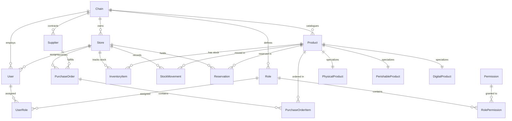

# 📊 Inventra: Multi-Tenant Smart Inventory System (SaaS)

Welcome to **Inventra**, a high-performance, secure, and production-grade Multi Tenant Smart Inventory System SaaS. Designed using Clean Architecture principles, Inventra provides retail chains and individual store branches with the tools to manage inventory catalogs, track real-time stock levels, prevent concurrency conflicts, and enforce granular access controls.

---

## 📖 Table of Contents

1. [🎯 Project Overview & Tenancy Model](#-project-overview--tenancy-model)
2. [🏗️ Architectural Overview](#️-architectural-overview)
3. [🛠️ Technology Stack](#️-technology-stack)
4. [📊 MVP vs. Target Scope Comparison](#-mvp-vs-target-scope-comparison)
5. [📂 Directory Structure](#-directory-structure)
6. [🚀 Getting Started & Local Setup](#-getting-started--local-setup)
7. [🧪 Testing Strategy & Verification](#-testing-strategy--verification)
8. [📚 Reference Documentation](#-reference-documentation)

---

## 🎯 Project Overview & Tenancy Model

Inventra implements a dual-tier **Store-Chain Tenancy Model** that matches real-world retail structures:

- **Chain (Tenant):** The top-level logical tenant representing the company brand (e.g., "Apex Retail"). Products, suppliers, and role permissions are managed globally at this level.
- **Store (Sub-tenant/Branch):** Individual physical or logical branches (e.g., "Apex Downtown Store", "Apex Warehouse"). Stock levels, inventory reservations, and history movement logs are scoped per Store.
- **Users & Access Scoping:**
  - **Chain Admins** possess chain-wide access and can interact with all stores.
  - **Store Managers & Employees** are pinned to a specific `StoreId` and are restricted to operations within that store.

> [!IMPORTANT]
> **Data Isolation Rule:** Every entity storing tenant data implements `ITenantEntity` and has a `ChainId` column. Tenancy isolation is strictly enforced at the database layer using EF Core **Global Query Filters**, ensuring Tenant A can never query Tenant B's data.

---

## 🏗️ Architectural Overview

### Clean Architecture Layers

The backend application is divided into four decoupled projects to isolate the domain logic from external dependencies and presentation details:

```
┌─────────────────────────────────────────────────────────┐
│                       API Layer                         │
│   (Controllers, Auth Middleware, JWT, Request/Response)  │
└───────────┬─────────────────────────────────┬───────────┘
            │                                 │
            ▼                                 ▼
┌────────────────────────┐       ┌────────────────────────┐
│   Application Layer    │       │  Infrastructure Layer  │
│ (Services, DTOs, Use   ├──────►│ (EF Core DbContext,    │
│ Cases, Validation)     │◄──────┤ Repositories, Hashers) │
└───────────┬────────────┘       └────────────────────────┘
            │
            ▼
┌────────────────────────┐
│      Domain Layer      │
│  (Entities, ValueObjs, │
│   Exceptions, Enums)   │
└────────────────────────┘
```

### Core Database Relationships (Entity Relationship Diagram)

Inventra supports **Table-Per-Type (TPT) Inheritance** for polymorphic product catalogs (e.g., Physical vs. Perishable products) and database-level concurrency protection:



---

## 🛠️ Technology Stack

### 🖥️ Backend (ASP.NET Core Web API)

- **Runtime & Framework:** .NET 8 / C#
- **Object-Relational Mapper (ORM):** Entity Framework Core (EF Core)
- **Database Engine:** PostgreSQL (with `xmin` optimistic concurrency tokens)
- **Authentication & Authorization:** JWT Authentication (15-min lifetime) + Refresh Token Rotation (7-day lifetime, encrypted with the ASP.NET Core **Data Protection API**).
- **Role-Based Access Control (RBAC):** Claims-based permissions via custom `[HasPermission]` authorization filters. Immediate role changes/revocations are cached in-memory (`IRoleRevocationCache`) to invalidate active tokens instantly.
- **Testing:** SQLite In-Memory database for transaction-safe, rapid integration and unit tests.

### 💻 Frontend Client (SPA)

- **Build Tool & Library:** Vite + React
- **Language:** TypeScript (enforces strict compile-time type-safety and maps to backend DTO contract definitions)
- **Server State Management:** TanStack Query v5 (React Query) (manages declarative fetching, automated caching, background updates, and automatic cache invalidation using query key tracking)
- **Client UI State:** Zustand (provides lightweight, boilerplate-free state management for local UI states like sidebar toggles and store branch selections)
- **Routing & RBAC:** React Router v6 (wrapped in custom, permission-aware `RouteGuard` components checking user claims on navigation)
- **API Client:** Axios (features auto-injecting bearer headers and custom response interceptors to handle seamless refresh token rotation)
- **Styling:** Native CSS (structured via CSS Modules for scoped styling and parameterized with HSL color variables for dark mode support)

---

## 📊 MVP vs. Target Scope Comparison

The project is structured to deliver a robust slice of value in its **MVP** phase, deferring advanced modules to the **Full Target Plan**:

| System Domain               | 🟩 MVP Scope (Included)                                                                            | 🟥 Target Plan (Deferred/Future)                                                         |
| :-------------------------- | :------------------------------------------------------------------------------------------------- | :--------------------------------------------------------------------------------------- |
| **Multi-Tenancy**           | Store-Chain structure, EF Core query isolation filters.                                            | Store-Chain structure, EF Core query isolation filters.                                  |
| **Authentication & RBAC**   | Static Roles (`ChainAdmin`, `StoreManager`, `StoreEmployee`) mapped to hardcoded permission lists. | Dynamic Roles & permissions editor DB tables, and managing UI.                           |
| **Product Catalog**         | Table-Per-Type (TPT) schema for **Physical** and **Perishable** products.                          | Support for **Digital Products** (with license keys and download links).                 |
| **Inventory & Procurement** | Manual stock level adjustments with audit log (`StockMovements` ledger).                           | Full procurement system (Suppliers database, Purchase Orders management, receipt flows). |
| **Stock Reservations**      | Transactional stock check, retry loops, and a 60-second background cleanup `BackgroundService`.    | PostgreSQL `pg_cron` database-native scheduling for expired reservation cleanup.         |
| **Cache Integration**       | Local `IMemoryCache` (In-process token revocation cache).                                          | Redis Distributed Cache (Required for multi-pod distributed setups).                     |

---

## 📂 Directory Structure

```
Inventra/
├── docs/                               # Architecture and roadmap plans
│   ├── implementation_plan.md          # Master architecture and full design blueprint
│   └── mvp_implementation_plan.md      # Detailed step-by-step MVP build checklist
│
├── backend/                            # ASP.NET Core Clean Architecture WebAPI
│   ├── Inventra.sln
│   ├── Inventra.Domain/                # Entities, Enums, Value Objects, Core Exceptions
│   ├── Inventra.Application/           # Services, Interfaces, DTOs, Validation
│   ├── Inventra.Infrastructure/        # EF Core DbContext, Migrations, Cryptography
│   └── Inventra.API/                   # Controllers, Middleware, Auth Setup, Entrypoint
│
└── frontend/                           # React + Vite + TypeScript SPA Client
    ├── src/
    │   ├── components/                 # Reusable UI widgets and layout headers
    │   ├── context/ & hooks/           # Authentication state & React Query custom hooks
    │   ├── pages/                      # Auth, Dashboard, Product List, and Stock Adjustment views
    │   ├── services/                   # Axios API client configuration and endpoints wrapper
    │   ├── store/                      # Zustand client-state configuration
    │   └── styles/                     # CSS Variables (supporting Dark Mode) and CSS modules
    ├── package.json
    └── vite.config.ts
```

---

## 🚀 Getting Started & Local Setup

### ⚙️ Prerequisites

Ensure you have the following installed:

- [.NET 8.0 SDK](https://dotnet.microsoft.com/download/dotnet/8.0)
- [Node.js (v18+) & npm](https://nodejs.org/)
- [PostgreSQL](https://www.postgresql.org/) (Running local server)

---

### 1. Backend Setup

1. Navigate to the backend directory:
   ```bash
   cd backend
   ```
2. Update the connection string in `Inventra.API/appsettings.json` to point to your local PostgreSQL instance:
   ```json
   "ConnectionStrings": {
     "DefaultConnection": "Host=localhost;Database=InventraDb;Username=postgres;Password=yourpassword"
   }
   ```
3. Apply Entity Framework migrations to generate the database schema:
   ```bash
   dotnet ef database update --project Inventra.Infrastructure --startup-project Inventra.API
   ```
4. Run the API:
   ```bash
   dotnet run --project Inventra.API
   ```
   The backend API will be available at `http://localhost:5000` (or `https://localhost:5001`).

---

### 2. Frontend Setup

1. Navigate to the frontend directory:
   ```bash
   cd frontend
   ```
2. Install the package dependencies:
   ```bash
   npm install
   ```
3. Start the Vite local development server:
   ```bash
   npm run dev
   ```
   The UI application will be accessible at `http://localhost:5173`.

---

## 🧪 Testing Strategy & Verification

The project includes an integration testing framework leveraging SQLite in-memory to ensure reliable isolated environments.

### Running Tests

Execute the test command inside the `backend/` directory:

```bash
dotnet test
```

### Core Verification Checklist

Before shipping modifications, ensure these core behaviors pass validation:

1. **Multi-Tenant Isolation:** Verify that creating items or products in `Tenant A` does not expose them to queries executed by `Tenant B`.
2. **Store-Level Scoping:** Ensure store-scoped users cannot access details or adjust stock of sibling stores belonging to the same chain.
3. **Concurrency Integrity:** Test concurrent stock requests. Simulating 10 parallel requests to reserve the last remaining stock item must result in exactly 1 success and 9 failures (yielding a `409 Conflict` or graceful stock-out response).
4. **Token Security:** Verify token rotation, invalidation on logouts, and re-authentication failures when an old refresh token is reused.

---

## 📚 Reference Documentation

For more information, please consult the design blueprints:

- [Master Architecture & Design Document (Full Plan)](docs/implementation_plan.md)
- [MVP Development & Build Roadmap](docs/mvp_implementation_plan.md)
