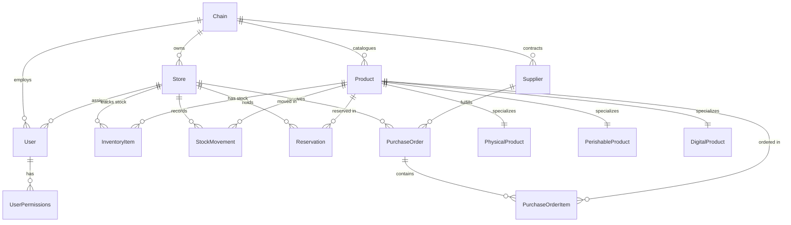
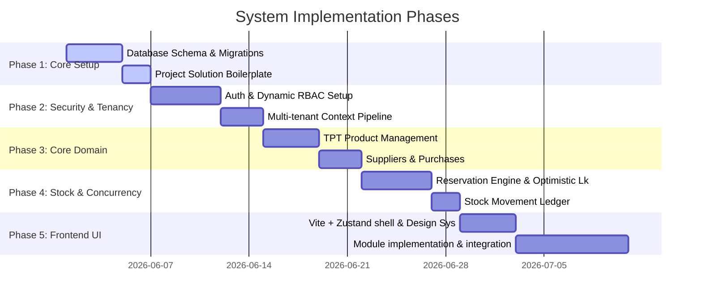

# Implementation Plan: Multi-Tenant Smart Inventory System (SaaS)

This document outlines the complete architectural design and implementation plan for the Multi-Tenant Smart Inventory System.

---

## 🗺️ 1. System Architecture Overview

### Store-Chain Tenancy Model
* **Chain (Tenant):** The top-level tenant. This represents the company or corporate brand (e.g., "Apex Retail"). Products, suppliers, and roles are defined globally at the Chain level.
* **Store (Sub-tenant/Branch):** A physical or logical location belonging to a Chain (e.g., "Apex Downtown Store", "Apex Warehouse"). Inventory stock, reservations, and stock movements are tracked individually per Store.
* **Users & Scoping:**
  * Users belong to a **Chain** and can optionally be assigned to a specific **Store**.
  * A **Chain Admin** has a `null` `StoreId` and can access all stores and global settings.
  * A **Store Employee/Manager** has a non-null `StoreId` and can only view/interact with inventory associated with their specific store.

> ⚠️ **ChainId Enforcement Rule:** Every entity that stores tenant data **must** implement `ITenantEntity` and carry a `ChainId` column. EF Core Global Query Filters are applied automatically to all `ITenantEntity` types. Any new entity added to the domain that omits `ChainId` will bypass the tenancy filter entirely and **must be treated as a critical bug**. This is enforced at the `AppDbContext` level and verified by integration tests.
> **Intentional exceptions:** `InventoryItem`, `Reservation`, and `StockMovement` deliberately do **not** implement `ITenantEntity`. Tenant isolation for these entities is enforced via an explicit join predicate (`Store.ChainId == tenantContext.ChainId`) on every query. This is a documented architectural decision, not a bug.

### Clean Architecture Layers
The backend is structured into four distinct layers in line with Clean Architecture:
```
┌─────────────────────────────────────────────────────────┐
│                       API Layer                         │
│   (Controllers, Auth Middleware, JWT, Request/Response)  │
└───────────┬─────────────────────────────────┬───────────┘
            │                                 │
            ▼                                 ▼
┌────────────────────────┐       ┌────────────────────────┐
│   Application Layer    │       │  Infrastructure Layer  │
│ (Services, DTOs, Use   ├──────►│ (EF Core DbContext,    │
│ Cases, Validation)     │◄──────┤ Repositories, Hashers) │
└───────────┬────────────┘       └────────────────────────┘
            │
            ▼
┌────────────────────────┐
│      Domain Layer      │
│  (Entities, ValueObjs, │
│   Exceptions, Enums)   │
└────────────────────────┘
```

---

## 🗄️ 2. Database Schema (PostgreSQL)

We will use PostgreSQL with Entity Framework Core. To handle product polymorphism, we implement **Table-Per-Type (TPT)**. To prevent race conditions during high-volume stock updates, we introduce a **Reservation** table and use PostgreSQL `xmin` system columns for optimistic concurrency.



### Table Schema Definitions

#### 🏢 Tenancy & Users
```sql
CREATE TABLE "Chains" (
    "Id" UUID PRIMARY KEY DEFAULT gen_random_uuid(),
    "Name" VARCHAR(100) NOT NULL,
    "PlanType" VARCHAR(20) NOT NULL, -- 'Free', 'Pro', 'Enterprise'
    "CreatedAt" TIMESTAMP WITH TIME ZONE DEFAULT CURRENT_TIMESTAMP
);

CREATE TABLE "Stores" (
    "Id" UUID PRIMARY KEY DEFAULT gen_random_uuid(),
    "ChainId" UUID NOT NULL REFERENCES "Chains"("Id") ON DELETE CASCADE,
    "Name" VARCHAR(100) NOT NULL,
    "Location" VARCHAR(200),
    "CreatedAt" TIMESTAMP WITH TIME ZONE DEFAULT CURRENT_TIMESTAMP
);

CREATE TABLE "Users" (
    "Id" UUID PRIMARY KEY DEFAULT gen_random_uuid(),
    "ChainId" UUID NOT NULL REFERENCES "Chains"("Id") ON DELETE CASCADE,
    "StoreId" UUID REFERENCES "Stores"("Id") ON DELETE SET NULL, -- NULL = Chain-wide access
    "Email" VARCHAR(150) NOT NULL UNIQUE,
    "PasswordHash" VARCHAR(255) NOT NULL,
    "FirstName" VARCHAR(50) NOT NULL,
    "LastName" VARCHAR(50) NOT NULL,
    "Role" VARCHAR(50) NOT NULL, -- e.g., 'ChainAdmin', 'StoreManager', 'StoreEmployee'
    "IsActive" BOOLEAN NOT NULL DEFAULT TRUE,
    "IsDeleted" BOOLEAN NOT NULL DEFAULT FALSE,
    "CreatedAt" TIMESTAMP WITH TIME ZONE DEFAULT CURRENT_TIMESTAMP
);
```

#### 🔐 User Permissions & Roles
```sql
-- Role functions as an identity and determines the default permissions granted at user creation.
-- The user's actual permissions are stored directly in UserPermissions, allowing them to be added or removed individually.

CREATE TABLE "UserPermissions" (
    "UserId" UUID NOT NULL REFERENCES "Users"("Id") ON DELETE CASCADE,
    "Permission" VARCHAR(50) NOT NULL, -- e.g., 'inventory:read', 'users:manage'
    "GrantedAt" TIMESTAMP WITH TIME ZONE DEFAULT CURRENT_TIMESTAMP,
    "GrantedByUserId" UUID REFERENCES "Users"("Id") ON DELETE SET NULL,
    PRIMARY KEY ("UserId", "Permission")
);
```

> 📋 **Permission Resolution Logic:** A user's effective permission set is loaded from the `UserPermissions` table at login time. The `AuthService` encodes this list directly into the JWT claims. The backend strictly checks the JWT for the required permission for each endpoint, and does not perform additional database lookups for authorization. The user's `Role` is also embedded in the JWT to serve as an identity for UI state and default permission templating, but backend authorization relies on the explicit permission list.

#### 🔑 Refresh Tokens (Data Protection API)
```sql
CREATE TABLE "RefreshTokens" (
    "Id" UUID PRIMARY KEY DEFAULT gen_random_uuid(),
    "UserId" UUID NOT NULL REFERENCES "Users"("Id") ON DELETE CASCADE,
    "TokenHash" VARCHAR(500) NOT NULL UNIQUE, -- SHA-256 hash of the Data Protection API token
    "ExpiresAt" TIMESTAMP WITH TIME ZONE NOT NULL, -- Long-lived: 7 days
    "IsRevoked" BOOLEAN NOT NULL DEFAULT FALSE,
    "CreatedAt" TIMESTAMP WITH TIME ZONE DEFAULT CURRENT_TIMESTAMP,
    "RevokedAt" TIMESTAMP WITH TIME ZONE
);

CREATE INDEX idx_refresh_tokens_userid ON "RefreshTokens"("UserId");
CREATE INDEX idx_refresh_tokens_hash ON "RefreshTokens"("TokenHash");
```

> 🔐 **Token Strategy:** Access JWTs are **short-lived (15 minutes)**. Refresh tokens are opaque values generated by `IDataProtector` (ASP.NET Core Data Protection API) — they are cryptographically signed, purpose-scoped, and stored hashed in this table. To invalidate a user's session, set `IsRevoked = TRUE`. The `POST /api/v1/auth/refresh` endpoint validates the token, checks revocation, and issues a new access JWT + rotated refresh token pair.

> 🚫 **Permission Revocation Blacklist:** Permissions are baked into the JWT at login time, so permission changes do not propagate until the token naturally expires (max 15 min). For **immediate session invalidation**, the API maintains an **`IUserRevocationCache`** — an `IMemoryCache`-backed in-process store. When a user's permissions or role are modified, their `UserId` is written to the cache with a 15-minute TTL. The `TenantMiddleware` checks this cache on every authenticated request: if the user's `UserId` is flagged as revoked, the request is immediately rejected with `401 Unauthorized`, forcing re-authentication and a fresh JWT.

#### 📦 Products (TPT Polymorphism)
```sql
-- Base Product Table
CREATE TABLE "Products" (
    "Id" UUID PRIMARY KEY DEFAULT gen_random_uuid(),
    "ChainId" UUID NOT NULL REFERENCES "Chains"("Id") ON DELETE CASCADE,
    "Name" VARCHAR(150) NOT NULL,
    "SKU" VARCHAR(50) NOT NULL,
    "Description" TEXT,
    "Price" DECIMAL(18,2) NOT NULL,
    "Type" VARCHAR(20) NOT NULL, -- 'Physical', 'Perishable', 'Digital'
    "LowStockThreshold" INT NOT NULL DEFAULT 10, -- Per-product alert threshold; used by the lowStockOnly inventory filter
    "IsActive" BOOLEAN NOT NULL DEFAULT TRUE,
    "CreatedAt" TIMESTAMP WITH TIME ZONE DEFAULT CURRENT_TIMESTAMP,
    UNIQUE("ChainId", "SKU")
);

-- Sub-type: PhysicalProduct
CREATE TABLE "PhysicalProducts" (
    "Id" UUID PRIMARY KEY REFERENCES "Products"("Id") ON DELETE CASCADE,
    "Weight" DECIMAL(10,2) NOT NULL,
    "Dimensions" VARCHAR(50), -- L x W x H
    "RequiresStorage" BOOLEAN NOT NULL DEFAULT TRUE
);

-- Sub-type: PerishableProduct
-- NOTE: ExpiryDate is NOT stored here. Expiry is a property of each received stock batch,
-- not the product definition itself. It is captured in PurchaseOrderItems.ExpiryDate at receipt time.
CREATE TABLE "PerishableProducts" (
    "Id" UUID PRIMARY KEY REFERENCES "Products"("Id") ON DELETE CASCADE,
    "StorageTemperature" DECIMAL(5,2) NOT NULL -- Required storage temperature in °C
);

-- Sub-type: DigitalProduct
CREATE TABLE "DigitalProducts" (
    "Id" UUID PRIMARY KEY REFERENCES "Products"("Id") ON DELETE CASCADE,
    "DownloadUrl" VARCHAR(500) NOT NULL,
    "LicenseKeyType" VARCHAR(50)
);
```

#### 📊 Inventory & Reservations
```sql
CREATE TABLE "InventoryItems" (
    "Id" UUID PRIMARY KEY DEFAULT gen_random_uuid(),
    "StoreId" UUID NOT NULL REFERENCES "Stores"("Id") ON DELETE CASCADE,
    "ProductId" UUID NOT NULL REFERENCES "Products"("Id") ON DELETE CASCADE,
    "Quantity" INT NOT NULL DEFAULT 0, -- Physical count in store
    UNIQUE("StoreId", "ProductId")
);

-- Note: EF Core maps PostgreSQL's system column 'xmin' (concurrency token) to a uint property
-- mapped via builder.Entity<InventoryItem>().Property(i => i.Version).HasColumnName("xmin").HasColumnType("xid").IsRowVersion();
```

```sql
CREATE TABLE "Reservations" (
    "Id" UUID PRIMARY KEY DEFAULT gen_random_uuid(),
    "StoreId" UUID NOT NULL REFERENCES "Stores"("Id") ON DELETE CASCADE,
    "ProductId" UUID NOT NULL REFERENCES "Products"("Id") ON DELETE CASCADE,
    "Quantity" INT NOT NULL,
    "Status" VARCHAR(20) NOT NULL, -- 'Pending', 'Completed', 'Cancelled', 'Expired'
    "ExpiresAt" TIMESTAMP WITH TIME ZONE NOT NULL,
    "CreatedByUserId" UUID REFERENCES "Users"("Id") ON DELETE RESTRICT, -- Users are soft-deleted via IsDeleted; hard deletion is blocked by RESTRICT as a safety net
    "CreatedAt" TIMESTAMP WITH TIME ZONE DEFAULT CURRENT_TIMESTAMP
);
```

#### 🔄 Stock History & Purchase Orders
```sql
CREATE TABLE "StockMovements" (
    "Id" UUID PRIMARY KEY DEFAULT gen_random_uuid(),
    "StoreId" UUID NOT NULL REFERENCES "Stores"("Id") ON DELETE CASCADE,
    "ProductId" UUID NOT NULL REFERENCES "Products"("Id") ON DELETE CASCADE,
    "Type" VARCHAR(20) NOT NULL, -- 'In', 'Out', 'Adjustment' (PascalCase — matches C# enum serialization)
    "Quantity" INT NOT NULL,
    "Reason" VARCHAR(250) NOT NULL, -- e.g., 'Purchase Order Receipt', 'Sale', 'Damaged Stock'
    "CreatedByUserId" UUID REFERENCES "Users"("Id") ON DELETE RESTRICT,
    "CreatedAt" TIMESTAMP WITH TIME ZONE DEFAULT CURRENT_TIMESTAMP
);

CREATE TABLE "Suppliers" (
    "Id" UUID PRIMARY KEY DEFAULT gen_random_uuid(),
    "ChainId" UUID NOT NULL REFERENCES "Chains"("Id") ON DELETE CASCADE,
    "Name" VARCHAR(100) NOT NULL,
    "ContactInfo" TEXT,
    "CreatedAt" TIMESTAMP WITH TIME ZONE DEFAULT CURRENT_TIMESTAMP
);

CREATE TABLE "PurchaseOrders" (
    "Id" UUID PRIMARY KEY DEFAULT gen_random_uuid(),
    "ChainId" UUID NOT NULL REFERENCES "Chains"("Id") ON DELETE CASCADE,
    "StoreId" UUID NOT NULL REFERENCES "Stores"("Id") ON DELETE CASCADE,
    "SupplierId" UUID NOT NULL REFERENCES "Suppliers"("Id") ON DELETE RESTRICT,
    "Status" VARCHAR(20) NOT NULL, -- 'Pending', 'Received', 'Cancelled'
    "CreatedByUserId" UUID REFERENCES "Users"("Id") ON DELETE SET NULL,
    "CreatedAt" TIMESTAMP WITH TIME ZONE DEFAULT CURRENT_TIMESTAMP
);

CREATE TABLE "PurchaseOrderItems" (
    "Id" UUID PRIMARY KEY DEFAULT gen_random_uuid(),
    "ChainId" UUID NOT NULL REFERENCES "Chains"("Id") ON DELETE CASCADE, -- Implements ITenantEntity; enables safe direct queries without joining through PurchaseOrders
    "PurchaseOrderId" UUID NOT NULL REFERENCES "PurchaseOrders"("Id") ON DELETE CASCADE,
    "ProductId" UUID NOT NULL REFERENCES "Products"("Id") ON DELETE CASCADE,
    "Quantity" INT NOT NULL,
    "UnitCost" DECIMAL(18,2) NOT NULL,
    "ExpiryDate" TIMESTAMP WITH TIME ZONE -- Nullable; populated for Perishable product batches to track per-batch expiry at receipt time
);
```

---

## 🔒 3. Tenancy Middleware & Concurrency Handling

### Tenancy Middleware Pipeline
Each authenticated request carries `ChainId` (and optionally `StoreId`) encoded in the JWT claims. 
1. **Extraction:** A custom ASP.NET Core Middleware extracts `ChainId` and `StoreId` from `HttpContext.User`.
2. **Context Injection:** Inject a scoped `ITenantContext` populated with the current request details:
   ```csharp
   public interface ITenantContext
   {
       Guid ChainId { get; }
       Guid? StoreId { get; }
   }
   ```
3. **EF Core Query Filtering:** In the `AppDbContext`, apply global query filters to automatically restrict queries to the tenant's data scope:
   ```csharp
   protected override void OnModelCreating(ModelBuilder modelBuilder)
   {
       // Apply multi-tenancy filter to all entities implementing ITenantEntity
       foreach (var entityType in modelBuilder.Model.GetEntityTypes())
       {
           // ⚠️ TPT GUARD: Skip derived types — EF Core throws if HasQueryFilter is applied
           // to a non-root type. The filter on the root entity (e.g. Product) propagates
           // automatically to PhysicalProduct and PerishableProduct via the TPT JOIN.
           if (entityType.BaseType != null) continue;

           if (typeof(ITenantEntity).IsAssignableFrom(entityType.ClrType))
           {
               modelBuilder.Entity(entityType.ClrType)
                   .HasQueryFilter(ConvertFilterExpression(entityType.ClrType));
           }
       }
   }
   ```
   > ⚠️ **Scoping note:** `InventoryItem`, `Reservation`, and `StockMovement` do **not** implement `ITenantEntity` and carry no `ChainId` column. Tenant isolation for these entities is enforced manually via a join predicate: `i.Store.ChainId == tenantContext.ChainId`. Every query against these entities **must** include this join — there is no automatic EF filter as a safety net.

### User Revocation Blacklist (In-Memory Cache)

Registered as a **singleton** service. When a user's permissions or role are modified via `UserService`, it calls `IUserRevocationCache.Revoke(userId)`. The middleware checks it on every request.

```csharp
public interface IUserRevocationCache
{
    void Revoke(Guid userId);
    bool IsRevoked(Guid userId);
}

public sealed class InMemoryUserRevocationCache : IUserRevocationCache
{
    private readonly IMemoryCache _cache;
    // TTL matches JWT lifetime — after expiry, re-auth would issue a fresh JWT anyway
    private static readonly TimeSpan Ttl = TimeSpan.FromMinutes(15);

    public InMemoryUserRevocationCache(IMemoryCache cache) => _cache = cache;

    public void Revoke(Guid userId) =>
        _cache.Set($"revoked_user:{userId}", true, Ttl);

    public bool IsRevoked(Guid userId) =>
        _cache.TryGetValue($"revoked_user:{userId}", out _);
}
```

**Integration in `TenantMiddleware`** (after claims extraction):
```csharp
var userIdClaim = context.User.FindFirst("userId")?.Value;
if (Guid.TryParse(userIdClaim, out var userId))
{
    if (_userRevocationCache.IsRevoked(userId))
    {
        context.Response.StatusCode = StatusCodes.Status401Unauthorized;
        await context.Response.WriteAsJsonAsync(new { error = "Session has been revoked due to permission changes. Please re-authenticate." });
        return;
    }
}
```

> ⚠️ **Multi-Pod Caveat:** This cache is **in-process only**. In a horizontally scaled deployment (multiple pods), a revocation sent to Pod A is not automatically propagated to Pod B. For true distributed revocation, swap `IMemoryCache` for a **Redis-backed `IDistributedCache`**. For the current single-pod MVP, this is acceptable.

### Safe Concurrency & Reservation Engine
To prevent race conditions where two threads try to claim the same stock, we implement a reservation model that calculates **Available Quantity** dynamically and handles EF Core concurrency exceptions.

* **Formula:**
  $$\text{Available Stock} = \text{InventoryItem.Quantity} - \sum \text{Pending/Unexpired Reservations.Quantity}$$
  
* **Reservation Flow:**
  1. Begin Transaction with standard isolation level.
  2. Query `InventoryItem` for (Store, Product). This includes the PostgreSQL `xmin` tracking token.
  3. Query active reservations:
     ```csharp
     var reservedQty = await _dbContext.Reservations
         .Where(r => r.StoreId == storeId && r.ProductId == productId 
                     && r.Status == ReservationStatus.Pending && r.ExpiresAt > DateTimeOffset.UtcNow)
         .SumAsync(r => r.Quantity);
     ```
  4. If `InventoryItem.Quantity - reservedQty >= requestedQty`, write a new `Reservation` record with status `Pending` and `ExpiresAt` (e.g., +15 mins).
  5. Save Changes.
  6. If a concurrent operation modified the `InventoryItem` (changing `xmin`), EF Core throws a `DbUpdateConcurrencyException`. The API catches this, rolls back, and retries the process (up to 3 times) or returns a `409 Conflict`.

* **Reservation Expiry Strategy — PostgreSQL `pg_cron`:**
  Expired reservations (`Status = 'Pending'` and `ExpiresAt < NOW()`) are cleaned up **directly inside the database** using the `pg_cron` extension. This removes any dependency on the API process being alive and eliminates the risk of multiple pods racing to perform cleanup.
  ```sql
  -- Enable pg_cron (run once as superuser)
  CREATE EXTENSION IF NOT EXISTS pg_cron;

  -- Schedule: run every minute, mark expired reservations
  SELECT cron.schedule(
      'expire-pending-reservations',
      '* * * * *',
      $$
          UPDATE "Reservations"
          SET "Status" = 'Expired'
          WHERE "Status" = 'Pending'
            AND "ExpiresAt" < NOW();
      $$
  );
  ```
  > This SQL is applied as part of a dedicated EF Core migration (data migration, not schema). The availability query already filters `ExpiresAt > UtcNow` so the system remains functionally correct even between cron runs.

> ℹ️ **Deployment Note:** `pg_cron` must be explicitly enabled on the PostgreSQL host. It is supported natively on **Supabase** and optionally on **AWS RDS** (via parameter group `shared_preload_libraries`). It is **not available on Azure Database for PostgreSQL Flexible Server**. If deploying to an incompatible host, the fallback strategy is a server-controlled `IHostedService` that executes the same `UPDATE` query on a 1-minute interval, using `SELECT pg_try_advisory_lock(...)` to prevent multiple pods from racing on the cleanup job.

---

## 🔌 4. API Endpoints Catalog

### Auth & Tenant Administration

> 🔖 **API Versioning:** All endpoints are versioned under `/api/v1/`. Versioning is implemented using the `Asp.Versioning.Mvc` NuGet package with URL segment strategy. When breaking changes are required in the future, a `/api/v2/` prefix is introduced while the old version is deprecated with a sunset header.

#### `POST /api/v1/auth/register-company`
* **Description:** Register a new Chain, create its default Admin role, assign full permissions, and register the initial administrator account.
* **Auth:** Public
* **Request Schema (`RegisterCompanyRequest`):**
```json
{
  "companyName": "Alpha Inc",
  "adminEmail": "admin@alphainc.com",
  "adminPassword": "SecurePassword123!",
  "adminFirstName": "John",
  "adminLastName": "Doe"
}
```
* **Response Schema (`AuthResponse`):** `201 Created`
  * The refresh token is **not** in the response body. It is set as an `HttpOnly`/`Secure`/`SameSite=Strict` cookie (`Set-Cookie: refreshToken=...`) with a 7-day expiry.
```json
{
  "accessToken": "eyJhbGciOi...",
  "accessTokenExpiresIn": 900,
  "email": "admin@alphainc.com",
  "role": "ChainAdmin",
  "permissions": ["stores:read", "stores:write", "products:read", "products:write", "inventory:read", "inventory:write", "inventory:adjust"],
  "userId": "3fa85f64-5717-4562-b3fc-2c963f66afa6",
  "chainId": "8fa85f64-5717-4562-b3fc-2c963f66afa7",
  "storeId": null
}
```

#### `POST /api/v1/auth/login`
* **Description:** Authenticate user and issue a short-lived JWT (15 min). The refresh token (7 days) is generated by the ASP.NET Core Data Protection API and returned as an `HttpOnly` cookie — never in the response body.
* **Auth:** Public
* **Request Schema:**
```json
{
  "email": "user@alphainc.com",
  "password": "Password123!"
}
```
* **Response Schema:** `200 OK` (Matches `AuthResponse` schema above — no `refreshToken` field in body.)

#### `POST /api/v1/auth/refresh`
* **Description:** Exchange a valid, non-revoked refresh token for a new access JWT and a rotated refresh token. The refresh token is read from the `refreshToken` HttpOnly cookie (sent automatically by the browser). Old refresh token is immediately invalidated after use; the rotated token is set as a new `HttpOnly` cookie.
* **Auth:** Public (refresh token in `HttpOnly` cookie — no request body required)
* **Request Schema:** *(no body)*
* **Response Schema:** `200 OK`
```json
{
  "accessToken": "eyJhbGciOi...",
  "accessTokenExpiresIn": 900,
  "email": "user@alphainc.com",
  "role": "StoreManager",
  "permissions": [...],
  "userId": "...",
  "chainId": "...",
  "storeId": "..."
}
```
* **Error Cases:**
  * `401 Unauthorized` — cookie is absent, invalid, malformed, or expired
  * `401 Unauthorized` — token has been revoked (session invalidated by admin)

#### `POST /api/v1/auth/logout`
* **Description:** Revoke the current refresh token cookie, effectively ending the session. The server reads the `refreshToken` HttpOnly cookie, marks the token as revoked, and deletes the cookie. Future refresh attempts will return 401.
* **Auth:** Bearer Token (optional — session is identified by the `refreshToken` cookie, not the access token body)
* **Request Schema:** *(no body — refresh token is read from the `refreshToken` HttpOnly cookie)*
* **Response Schema:** `204 No Content`
  * On success, the server calls `Response.Cookies.Delete("refreshToken")` to clear the cookie.

#### `GET /api/v1/auth/me`
* **Description:** Retrieve current authenticated user session detail including effective permissions (union of role-based + direct grants).
* **Auth:** Bearer Token
* **Response Schema:** `200 OK` (Current user details including roles and permissions).

---

### Stores Management

#### `POST /api/v1/stores`
* **Description:** Create a new store branch under the chain.
* **Auth:** Permissions: `stores:write`
* **Request Schema (`CreateStoreRequest`):**
```json
{
  "name": "Eastside Warehouse",
  "location": "123 East Blvd, NY"
}
```
* **Response Schema:** `201 Created`
```json
{
  "id": "e22eb5f7-669b-4395-8d59-2ff611603513",
  "chainId": "8fa85f64-5717-4562-b3fc-2c963f66afa7",
  "name": "Eastside Warehouse",
  "location": "123 East Blvd, NY"
}
```

#### `GET /api/v1/stores`
* **Description:** Get all store locations for the chain.
* **Auth:** Permissions: `stores:read`
* **Query Parameters:**
  * `page` (int, default: 1)
  * `pageSize` (int, default: 25, max: 100)
  * `search` (string, optional) — filters by store name
* **Response Schema:** `200 OK`
```json
{
  "items": [ ],
  "totalCount": 12,
  "page": 1,
  "pageSize": 25
}
```

> 📌 **Future Implementation:** `PATCH /api/v1/stores/{id}` (update name/location), `DELETE /api/v1/stores/{id}` (soft-delete with cascade deactivation of store-scoped users).

#### `GET /api/v1/stores/accessible`
* **Description:** Returns a lightweight list of stores the **current user** can access. For `ChainAdmin` users, this is all stores in the chain (paginated). For `StoreManager` / `StoreEmployee`, this returns only their single assigned store. Used by the Dashboard to resolve the `storeId` for the `GET /api/v1/inventory/summary` call without relying on URL params or persisted Zustand state.
* **Auth:** Permissions: `stores:read`
* **Query Parameters:**
  * `page` (int, default: 1)
  * `pageSize` (int, default: 25, max: 100)
* **Response Schema:** `200 OK` — Same paginated wrapper as `GET /api/v1/stores`
```json
{
  "items": [
    { "id": "e22eb5f7-669b-4395-8d59-2ff611603513", "name": "Eastside Warehouse", "location": "123 East Blvd, NY" }
  ],
  "totalCount": 1,
  "page": 1,
  "pageSize": 25
}
```

---

### User & Dynamic RBAC Management (Admin Only)

#### `GET /api/v1/users`
* **Description:** Retrieve a list of users within the chain.
* **Auth:** Permissions: `users:read`
* **Query Parameters:**
  * `page` (int, default: 1), `pageSize` (int, default: 25, max: 100)
  * `search` (string, optional) — filters by name or email
  * `storeId` (UUID, optional) — filter by assigned store
* **Response Schema:** `200 OK` Paginated array of user objects (excluding password hashes).

#### `POST /api/v1/users`
* **Description:** Create a user account and bind them to a role (which populates their default permissions) and optionally a store.
* **Auth:** Permissions: `users:write`
* **Request Schema:**
```json
{
  "email": "employee@alphainc.com",
  "firstName": "Jane",
  "lastName": "Smith",
  "password": "Password123!",
  "storeId": "e22eb5f7-669b-4395-8d59-2ff611603513",
  "role": "StoreManager"
}
```
* **Response Schema:** `201 Created` (Created user detail).

#### `POST /api/v1/users/{userId}/permissions`
* **Description:** Grant specific permissions to a user (mutating their role-based defaults).
* **Auth:** Permissions: `users:manage`
* **Request Schema:**
```json
{ "permissions": ["inventory:adjust", "stores:write"] }
```
* **Response Schema:** `200 OK`

#### `DELETE /api/v1/users/{userId}/permissions`
* **Description:** Revoke specific permissions from a user.
* **Auth:** Permissions: `users:manage`
* **Request Schema:**
```json
{ "permissions": ["inventory:adjust"] }
```
* **Response Schema:** `204 No Content`

> 📌 **Future Implementation:** `PATCH /api/v1/users/{id}` (update store assignment, active status, role), `DELETE /api/v1/users/{id}` (soft-delete / deactivate). Permission editing via the UI is planned for a future phase (post-MVP).

---

### Products Catalog

#### `POST /api/v1/products`
* **Description:** Create a product. Supports Physical, Perishable, and Digital configurations mapping directly to TPT entities.
* **Auth:** Permissions: `products:write`
* **Request Schema (`CreateProductRequest`):**
  > ℹ️ **Flat DTO (no nested spec objects):** All sub-type fields are top-level on the request. Fields not applicable to the chosen `productType` must be `null`.
```json
{
  "name": "Fresh Organic Milk",
  "sku": "MILK-ORG-01",
  "description": "1 Gallon Pasteurized Milk",
  "price": 4.99,
  "productType": "Perishable",
  "storageTemperature": 4.0,
  "weightKg": null,
  "dimensions": null
}
```
  > ⚠️ `ExpiryDate` is **not** a product-level field. Expiry is a batch property captured on `PurchaseOrderItem.ExpiryDate` at receipt time. `PerishableProduct` stores only `StorageTemperature` (decimal °C).
* **Response Schema:** `201 Created`
```json
{
  "id": "b1b85f64-5717-4562-b3fc-2c963f66afa8",
  "name": "Fresh Organic Milk",
  "sku": "MILK-ORG-01",
  "description": "1 Gallon Pasteurized Milk",
  "price": 4.99,
  "type": "Perishable",
  "perishableSpecs": {
    "storageTemperature": 4.0
  },
  "isActive": true
}
```

#### `GET /api/v1/products`
* **Description:** Retrieve products for the chain.
* **Auth:** Permissions: `products:read`
* **Query Parameters:**
  * `page` (int, default: 1), `pageSize` (int, default: 25, max: 100)
  * `search` (string) — filter by name or SKU
  * `type` (string) — filter by product type: `Physical`, `Perishable`, `Digital`
  * `isActive` (bool, default: true)
* **Response Schema:** `200 OK` Paginated array of product records with polymorphic spec blocks.

> 📌 **Future Implementation:** `PATCH /api/v1/products/{id}` (update name, price, description, `lowStockThreshold`, `isActive`), `DELETE /api/v1/products/{id}` (soft-delete; sets `IsActive = false`).

---

### Inventory & Reservations Engine

#### `GET /api/v1/inventory`
* **Description:** Retrieve stock levels. If user is store-scoped (StoreManager / StoreEmployee), only returns stock for their JWT-embedded store and ignores `storeId` query param. ChainAdmins receive all stores by default; they may supply `storeId` to filter to a specific store.
* **Auth:** Permissions: `inventory:read`
* **Query Parameters:**
  * `page` (int, default: 1), `pageSize` (int, default: 25, max: 100)
  * `storeId` (UUID, optional — **ChainAdmin only**; ignored and overridden by JWT claim for store-scoped users)
  * `search` (string) — filter by product name or SKU
  * `lowStockOnly` (bool) — returns only items where `availableQuantity < threshold`
* **Response Schema:** `200 OK`
```json
{
  "items": [
    {
      "productId": "b1b85f64-5717-4562-b3fc-2c963f66afa8",
      "productName": "Fresh Organic Milk",
      "sku": "MILK-ORG-01",
      "storeId": "e22eb5f7-669b-4395-8d59-2ff611603513",
      "storeName": "Eastside Warehouse",
      "physicalQuantity": 100,
      "reservedQuantity": 15,
      "availableQuantity": 85
    }
  ],
  "totalCount": 1,
  "page": 1,
  "pageSize": 25
}
```

#### `GET /api/v1/inventory/summary`
* **Description:** Retrieve high-level stock statistics (total product lines and low-stock alerts count) for the dashboard. ChainAdmins can scope this to a specific store via `?storeId=`; store-scoped users always receive stats for their assigned store.
* **Auth:** Permissions: `inventory:read`
* **Query Parameters:**
  * `storeId` (UUID, optional — **ChainAdmin only**; ignored and overridden by JWT claim for store-scoped users)
* **Response Schema:** `200 OK`
```json
{
  "totalProductLines": 150,
  "lowStockCount": 12
}
```

#### `POST /api/v1/inventory/reserve`
* **Description:** Reserve a specific quantity of stock for a product in a store. Safe against race conditions.
* **Auth:** Permissions: `inventory:write`
* **Request Schema:**
```json
{
  "storeId": "e22eb5f7-669b-4395-8d59-2ff611603513",
  "productId": "b1b85f64-5717-4562-b3fc-2c963f66afa8",
  "quantity": 5,
  "lifetimeMinutes": 15
}
```
> ⚠️ **Security Note:** `lifetimeMinutes` is accepted from the client for operational flexibility (e.g., short vs. long-hold reservations). The server **must clamp this value** against a configured maximum (e.g., `appsettings.json: "Inventory:MaxReservationLifetimeMinutes": 60`) before persisting. Clients cannot set arbitrarily large expirations to hoard stock indefinitely.

> ⚠️ **Store-Scope Security:** The service **must validate** that `request.StoreId == tenantContext.StoreId` when `tenantContext.StoreId != null` (i.e., when the caller is a `StoreEmployee` or `StoreManager`). A store-scoped user supplying a different `storeId` in the body must receive `403 Forbidden`. ChainAdmins (null `StoreId`) may target any store in their chain.

* **Response Schema:** `201 Created`
```json
{
  "reservationId": "9c8b7f64-5717-4562-b3fc-2c963f66afa0",
  "expiresAt": "2026-06-01T16:20:00Z",
  "status": "Pending"
}
```

#### `POST /api/v1/inventory/adjust`
* **Description:** Manually adjust physical stock values (triggers audit logging via StockMovements). Returns 404 if the item doesn't exist yet.
* **Auth:** Permissions: `inventory:adjust`
* **Request Schema:**
```json
{
  "storeId": "e22eb5f7-669b-4395-8d59-2ff611603513",
  "productId": "b1b85f64-5717-4562-b3fc-2c963f66afa8",
  "delta": -2,
  "movementType": "Adjustment",
  "reason": "Damaged container during delivery"
}
```
> ⚠️ **Store-Scope Security:** The service **must validate** that `request.StoreId == tenantContext.StoreId` when `tenantContext.StoreId != null` (i.e., when the caller is a `StoreEmployee` or `StoreManager`). A store-scoped user supplying a different `storeId` in the body must receive `403 Forbidden`. ChainAdmins (null `StoreId`) may target any store in their chain.

* **Response Schema:** `200 OK` (Updated inventory levels).

> 📌 **Future Implementation:** `PATCH /api/v1/inventory/reservations/{id}` (cancel a pending reservation), `PATCH /api/v1/inventory/items/{id}` (update `lowStockThreshold` override at store level).

---

### Suppliers & Procurement

#### `GET /api/v1/suppliers`
* **Description:** List all suppliers for the chain.
* **Auth:** Permissions: `suppliers:read`
* **Query Parameters:** `page`, `pageSize`, `search` (name)
* **Response Schema:** `200 OK` Paginated supplier list.

#### `POST /api/v1/suppliers`
* **Description:** Create a new supplier profile.
* **Auth:** Permissions: `suppliers:write`
* **Request Schema:**
```json
{
  "name": "Global Dairy Farms",
  "contactInfo": "sales@globaldairy.com | +1-800-555-0199"
}
```
* **Response Schema:** `201 Created`

#### `GET /api/v1/purchase-orders`
* **Description:** List purchase orders for the chain/store.
* **Auth:** Permissions: `orders:read`
* **Query Parameters:** `page`, `pageSize`, `storeId`, `status` (`Pending`, `Received`, `Cancelled`)
* **Response Schema:** `200 OK` Paginated PO list.

#### `POST /api/v1/purchase-orders`
* **Description:** Place a purchase order for restocking a store.
* **Auth:** Permissions: `orders:write`
* **Request Schema:**
```json
{
  "storeId": "e22eb5f7-669b-4395-8d59-2ff611603513",
  "supplierId": "9b122f57-669b-4395-8d59-2ff611603514",
  "items": [
    {
      "productId": "b1b85f64-5717-4562-b3fc-2c963f66afa8",
      "quantity": 50,
      "unitCost": 3.50
    }
  ]
}
```
* **Response Schema:** `201 Created` (Purchase order summary with status `Pending`).

#### `POST /api/v1/purchase-orders/{id}/receive`
* **Description:** Mark PO as completed. Increases store's physical inventory and logs an `IN` stock movement.
* **Auth:** Permissions: `orders:write`
* **Response Schema:** `200 OK`

> 📌 **Future Implementation:** `PATCH /api/v1/purchase-orders/{id}` (update status to `Cancelled`), `PATCH /api/v1/suppliers/{id}` (update contact info), `DELETE /api/v1/suppliers/{id}` (soft-delete).

---

## 🎨 5. Frontend Architecture (React + Vite)

### Technical Stack
* **Build Tool:** Vite (for fast HMR and highly optimized production builds)
* **Language:** TypeScript (strict type checking enabled to prevent runtime errors and share DTO interfaces)
* **Router:** React Router v6 (for client-side routing, nested layouts, and route guards)
* **Server State:** TanStack Query v5 (React Query) (for caching, query invalidation, background synchronization, and request lifecycle management)
* **Client UI State:** Zustand (for lightweight, zero-boilerplate global UI state management — in-memory only, no persistence)
* **Form Validation:** `react-hook-form` + `zod` (schema-driven validation with discriminated union support for polymorphic forms)
* **Styling:** Native CSS (using standard CSS modules for scope isolation and HSL variable-based themes)

### Auth & Token Architecture
* **Access Token (JWT):** Stored in Zustand in-memory state only. Injected into every request via Axios request interceptor. Lost on page reload — re-hydrated via silent refresh on app mount.
* **Refresh Token:** Delivered and stored exclusively as an `HttpOnly`/`Secure`/`SameSite=Strict` cookie. Never accessible from JavaScript. Automatically included by the browser on every `POST /api/v1/auth/refresh` call.
* **Silent Refresh on Mount:** `App.tsx` tracks an `isHydrating: boolean` state (initially `true`). While `isHydrating` is `true`, a full-screen spinner (centered logo + subtle animation) is rendered. `POST /api/v1/auth/refresh` is called with a **5-second Axios timeout** — if the backend is unreachable, the timeout prevents an infinite spinner. On success, the Zustand store is populated and `isHydrating` is set to `false`. On failure (cookie expired/absent or timeout), `isHydrating` is set to `false` and `RouteGuard` redirects to `/login`.
* **Singleton Refresh Guard:** The Axios response interceptor uses a module-level `refreshPromise: Promise<string> | null`. Multiple concurrent 401s share one refresh call; all queued requests retry with the new token.

### Folder Structure
We will organize the project in the workspace root with two main folders: `backend/` and `frontend/`. The frontend project is structured as follows:

```
frontend/
├── public/
├── src/
│   ├── assets/
│   ├── components/
│   │   ├── common/
│   │   │   ├── Table.tsx
│   │   │   ├── Modal.tsx
│   │   │   └── Input.tsx
│   │   ├── layout/
│   │   │   ├── Sidebar.tsx
│   │   │   ├── Topbar.tsx          -- Store picker (ChainAdmin only); navigates to /inventory/:storeId
│   │   │   └── Layout.tsx
│   │   └── protected/
│   │       └── RouteGuard.tsx      -- Checks isAuthenticated + optional permission; store-scopes inventory
│   ├── hooks/
│   │   ├── useAuth.ts
│   │   └── useInventory.ts
│   ├── pages/
│   │   ├── auth/
│   │   │   ├── Login.tsx
│   │   │   └── RegisterCompany.tsx
│   │   ├── dashboard/
│   │   │   └── Dashboard.tsx
│   │   ├── products/
│   │   │   └── ProductsList.tsx    -- Polymorphic create form with zod discriminated union
│   │   ├── inventory/
│   │   │   └── StockControl.tsx    -- Route: /inventory/:storeId; MovementType dropdown
│   │   ├── suppliers/
│   │   │   └── SuppliersList.tsx
│   │   ├── orders/
│   │   │   └── PurchaseOrders.tsx
│   │   └── users/
│   │       └── UserSettings.tsx
│   ├── services/
│   │   ├── apiClient.ts            -- Axios instance; singleton 401-intercept → cookie refresh → retry
│   │   └── api/
│   │       ├── authService.ts
│   │       ├── productService.ts
│   │       └── inventoryService.ts
│   ├── store/
│   │   ├── authStore.ts            -- In-memory JWT, email, role, permissions, userId, chainId, storeId
│   │   └── uiStore.ts              -- Zustand store for sidebar toggles and other transient UI state
│   ├── styles/
│   │   ├── variables.css           -- Color system (HSL variables for light/dark theme)
│   │   ├── global.css
│   │   └── modules/                -- CSS Modules for custom styling
│   │       ├── Sidebar.module.css
│   │       ├── Layout.module.css
│   │       └── Card.module.css
│   ├── types/
│   │   └── index.ts                -- Central TypeScript interfaces matching backend DTOs
│   ├── App.tsx                     -- Silent-refresh bootstrap on mount
│   └── main.tsx
├── package.json
└── tsconfig.json
```

### TypeScript Integration Guidelines

To guarantee full type safety across the client-server boundary, the frontend implements the following TypeScript practices:
1. **Strict Type Safety:** `noImplicitAny` and `strictNullChecks` are enabled in `tsconfig.json`.
2. **DTO & Domain Models:** All request payloads and response bodies have dedicated TypeScript interfaces matching the backend models (e.g. `ProductDto`, `StockMovementDto`, `RegisterCompanyRequest`).
3. **Generics in API Requests:** Axios client calls and TanStack Query hooks utilize these interfaces to ensure compile-time verification of properties.

### State Management Strategy

#### 1. Server State (TanStack Query v5)
Used for all asynchronous operations communicating with the backend database. TanStack Query isolates caching logic, background synchronization, and automatic loading/error indicators.

* **Query Keys:** Structured as hierarchical arrays for clean invalidation: `['products']`, `['products', productId]`, `['inventory', storeId]`.
* **v5 Syntax:** Queries and mutations use object parameters instead of deprecated positional arguments.

##### **Example: Custom Hook for Product Management**
```typescript
import { useQuery, useMutation, useQueryClient } from '@tanstack/react-query';
import { fetchProducts, createProduct } from '../services/api/productService';
import { ProductDto, CreateProductRequest } from '../types';

export const useProducts = () => {
  const queryClient = useQueryClient();

  // Query catalog using object arguments (v5 standard)
  const productsQuery = useQuery<ProductDto[], Error>({
    queryKey: ['products'],
    queryFn: fetchProducts,
    staleTime: 5 * 60 * 1000, // Cache valid for 5 minutes
  });

  // Mutation for creating a new product with cache invalidation on success
  const createProductMutation = useMutation<ProductDto, Error, CreateProductRequest>({
    mutationFn: (newProduct) => createProduct(newProduct),
    onSuccess: () => {
      // Invalidate products query cache to trigger automatic background refetch
      queryClient.invalidateQueries({ queryKey: ['products'] });
    },
  });

  return {
    products: productsQuery.data ?? [],
    isLoading: productsQuery.isLoading,
    isError: productsQuery.isError,
    error: productsQuery.error,
    createProduct: createProductMutation.mutateAsync,
    isCreating: createProductMutation.isPending,
  };
};
```

#### 2. Local State (Zustand)
Two Zustand stores are used:

**`authStore.ts`** — Holds the in-memory JWT and resolved user identity. No persistence. Re-hydrated from the HttpOnly cookie on app mount via silent refresh.
```typescript
import { create } from 'zustand';
import type { AuthResponse } from '../types';

interface AuthState {
  token: string | null;
  email: string | null;
  role: string | null;
  permissions: string[];
  userId: string | null;
  chainId: string | null;
  storeId: string | null; // null = ChainAdmin (no store scope)
  setAuth: (response: AuthResponse, token: string) => void;
  clearAuth: () => void;
}

export const useAuthStore = create<AuthState>((set) => ({
  token: null, email: null, role: null, permissions: [],
  userId: null, chainId: null, storeId: null,
  setAuth: (response, token) => set({
    token, email: response.email, role: response.role,
    permissions: response.permissions, userId: response.userId,
    chainId: response.chainId, storeId: response.storeId ?? null,
  }),
  clearAuth: () => set({ token: null, email: null, role: null, permissions: [],
    userId: null, chainId: null, storeId: null }),
}));
```

**`uiStore.ts`** — Transient UI state only (sidebar toggle, etc.). The selected store is **not** stored here — it lives in the URL as `/inventory/:storeId`.
```typescript
import { create } from 'zustand';

interface UIState {
  sidebarOpen: boolean;
  toggleSidebar: () => void;
}

export const useUIStore = create<UIState>((set) => ({
  sidebarOpen: true,
  toggleSidebar: () => set((state) => ({ sidebarOpen: !state.sidebarOpen })),
}));
```

### Route-Level RBAC Protection
We wrap components using a `RouteGuard` to check user permissions dynamically before loading pages.

```tsx
import React from 'react';
import { Navigate } from 'react-router-dom';
import { useAuth } from '../hooks/useAuth';

interface RouteGuardProps {
  requiredPermission?: string;
  storeScope?: boolean; // When true, enforces that non-ChainAdmin users can only access their own storeId
  children: React.ReactNode;
}

export const RouteGuard: React.FC<RouteGuardProps> = ({ requiredPermission, storeScope, children }) => {
  const { isAuthenticated, isChainAdmin, hasPermission, storeId: jwtStoreId } = useAuth();
  const { storeId: paramStoreId } = useParams();

  if (!isAuthenticated) {
    return <Navigate to="/login" replace />;
  }

  // Check required permission using the hasPermission helper (handles wildcard '*')
  if (requiredPermission && !hasPermission(requiredPermission)) {
    return <Navigate to="/unauthorized" replace />;
  }

  // Store-scope guard: non-ChainAdmin users may only access their own store's URL.
  // Uses a synchronous early return (not useEffect+navigate) to prevent children from
  // rendering — and firing useQuery — before the redirect resolves.
  if (storeScope && !isChainAdmin && paramStoreId && paramStoreId !== jwtStoreId) {
    return <Navigate to={`/inventory/${jwtStoreId}`} replace />;
  }

  return <>{children}</>;
};
```

> 📌 **Route Tree Requirement:** The `/unauthorized` route **must** be declared in the React Router `<Routes>` tree alongside `/login` and `/register`. It should render an "Access Denied" page with a descriptive message and a back link (e.g., navigate to `/dashboard`). Without this route, the `<Navigate to="/unauthorized" replace />` in `RouteGuard` will silently no-op, leaving the user on the protected page.

---

## 🚀 6. Step-by-Step Implementation Roadmap & Unit Testing Plan



### 🛠️ Detailed Build Order, Substeps & Mock Unit Testing Plan

---

#### 📦 Phase 1: Core Setup & Boilerplate

##### **Step 1: Create clean architecture solution template**
* **1.1. Substeps:**
  1. In the workspace root, create two parent directories: `backend/` and `frontend/`.
  2. Initialize the dotnet solution inside the `backend/` folder: `dotnet new sln -n Inventra` (from the `backend/` context).
  3. Create the 4 class libraries/webapi projects representing Clean Architecture layers inside the `backend/` directory:
     - `backend/Inventra.Domain` (Class Library): Encompasses base entities, enums, value objects.
     - `backend/Inventra.Application` (Class Library): Houses application services, interfaces, DTOs, CQRS (if used), validations.
     - `backend/Inventra.Infrastructure` (Class Library): Contains EF Core DB context, migrations, repository implementations, third-party adapters (e.g., token, password hashers).
     - `backend/Inventra.API` (Web API): API Controllers, middlewares, configuration files, authentication setup.
  4. Link the projects to the solution: `dotnet sln add Inventra.Domain Inventra.Application Inventra.Infrastructure Inventra.API` within the `backend/` folder.
  5. Wire up project dependencies: `API` depends on `Application` and `Infrastructure`; `Infrastructure` depends on `Application`; `Application` depends on `Domain`.
  6. Install global packages: `Microsoft.EntityFrameworkCore`, `Npgsql.EntityFrameworkCore.PostgreSQL`, `BCrypt.Net-Next`, `Microsoft.AspNetCore.Authentication.JwtBearer`.

* **1.2. Unit Testing & Mocking Strategy:**
  * **Objective:** Ensure dependency injection (DI) bootstrap bindings resolve all core services cleanly.
  * **Test Setup:** Use the custom API Host builder to perform a dry run resolution test.
  * **Mock Details:** Mock the connection string to prevent actual database connections during DI resolution checks.
  * **Functions to Test:**
    * `Program.cs` / Dependency Injection registrations.
  * **Sample Mock Setup & Test Case:**
    ```csharp
    [Fact]
    public void DependencyInjection_ShouldResolveCoreServices()
    {
        var services = new ServiceCollection();
        // Setup configuration mock
        var mockConfig = new Mock<IConfiguration>();
        mockConfig.Setup(c => c["ConnectionStrings:DefaultConnection"])
                  .Returns("Host=localhost;Database=TestDb;Username=postgres;Password=pwd");

        // Act & Assert registrations
        // Check that ITenantContext, IProductService, IReservationService resolve correctly without throwing.
    }
    ```

##### **Step 2: Initialize Database Context and Tenancy Pipeline**
* **2.1. Substeps:**
  1. Define `ITenantEntity` interface in the Domain layer:
     ```csharp
     public interface ITenantEntity
     {
         Guid ChainId { get; set; }
     }
     ```
  2. Create `AppDbContext` in the Infrastructure layer, inheriting from `DbContext`.
  3. Overwrite `OnModelCreating` to automatically apply the Multi-Tenant Global Query Filter to all entities implementing `ITenantEntity`.
  4. Map the PostgreSQL `xmin` system column to the `InventoryItem` entity (the only entity requiring optimistic concurrency control) by configuring it as `.IsRowVersion()` in EF Core. Do **not** configure xmin on `Reservation` -- it adds model complexity for no benefit, since reservation conflicts are handled via the availability check and retry logic.
  5. Run the initial EF Core migration using Entity Framework CLI: `dotnet ef migrations add InitialMigration --project Inventra.Infrastructure --startup-project Inventra.API`.

* **2.2. Unit Testing & Mocking Strategy:**
  * **Objective:** Validate that global query filtering correctly isolates DB operations between tenants.
  * **Test Setup:** Use SQLite in-memory (`UseSqlite("DataSource=:memory:")`) to populate test data for multiple ChainIds. SQLite enforces real SQL semantics including unique constraints, unlike the EF InMemory provider.
  * **Mock Details:** Mock the `ITenantContext` to switch between Chain IDs during the execution.
  * **Functions to Test:**
    * `AppDbContext.OnModelCreating()` (specifically global query filters).
  * **Sample Mock Setup & Test Case:**
    ```csharp
    [Fact]
    public async Task DbContext_GlobalQueryFilter_IsolatesTenantData()
    {
        // 1. Arrange
        var mockTenantContext = new Mock<ITenantContext>();
        mockTenantContext.Setup(t => t.ChainId).Returns(Guid.Parse("11111111-1111-1111-1111-111111111111"));

        var options = new DbContextOptionsBuilder<AppDbContext>()
            .UseSqlite("DataSource=:memory:")
            .Options;

        using var context = new AppDbContext(options, mockTenantContext.Object);
        // Seed database with multiple tenants' records
        context.Stores.Add(new Store { Id = Guid.NewGuid(), ChainId = Guid.Parse("11111111-1111-1111-1111-111111111111"), Name = "Tenant 1 Store" });
        context.Stores.Add(new Store { Id = Guid.NewGuid(), ChainId = Guid.Parse("22222222-2222-2222-2222-222222222222"), Name = "Tenant 2 Store" });
        await context.SaveChangesAsync();

        // 2. Act
        var filteredStores = await context.Stores.ToListAsync();

        // 3. Assert
        Assert.Single(filteredStores);
        Assert.Equal("Tenant 1 Store", filteredStores.First().Name);
    }
    ```

---

#### 🔐 Phase 2: Security, Tenancy Pipeline & RBAC

##### **Step 3: Build Custom Tenancy Extraction Middleware**
* **3.1. Substeps:**
  1. Define a scoped `ITenantContext` interface and its implementation:
     ```csharp
     public interface ITenantContext
     {
         Guid ChainId { get; set; }
         Guid? StoreId { get; set; }
     }
     ```
  2. Implement `TenantMiddleware` to inspect incoming HTTP requests.
  3. Extract `ChainId` and `StoreId` from claims present in the authenticated JWT token.
  4. Populate the scoped `ITenantContext` instance so that it's accessible within service layers and `AppDbContext` for the duration of the request.
  5. Add fallback handling to reject requests with `401 Unauthorized` if requests to protected endpoints fail to provide a valid token or tenant scope.

* **3.2. Unit Testing & Mocking Strategy:**
  * **Objective:** Ensure the middleware accurately reads Claims and binds them to the context container.
  * **Test Setup:** Mock `HttpContext`, `ClaimsPrincipal`, and `RequestDelegate`.
  * **Mock Details:** Mock the context claims collection, simulating an authenticated user with distinct claim configurations.
  * **Functions to Test:**
    * `TenantMiddleware.InvokeAsync(HttpContext context, ITenantContext tenantContext)`
  * **Sample Mock Setup & Test Case:**
    ```csharp
    [Fact]
    public async Task TenantMiddleware_ExtractsClaims_PopulatesTenantContext()
    {
        // 1. Arrange
        var chainId = Guid.NewGuid();
        var storeId = Guid.NewGuid();
        
        var claims = new List<Claim>
        {
            new Claim("ChainId", chainId.ToString()),
            new Claim("StoreId", storeId.ToString())
        };
        var identity = new ClaimsIdentity(claims, "TestAuth");
        var claimsPrincipal = new ClaimsPrincipal(identity);

        var mockHttpContext = new Mock<HttpContext>();
        mockHttpContext.Setup(c => c.User).Returns(claimsPrincipal);

        var tenantContext = new TenantContext(); // Concrete scoped registration
        var middleware = new TenantMiddleware(next: (innerHttpContext) => Task.CompletedTask);

        // 2. Act
        await middleware.InvokeAsync(mockHttpContext.Object, tenantContext);

        // 3. Assert
        Assert.Equal(chainId, tenantContext.ChainId);
        Assert.Equal(storeId, tenantContext.StoreId);
    }
    ```

##### **Step 4: Implement Permission-Checking Action Filters**
* **4.1. Substeps:**
  1. Define a custom `[HasPermission]` authorization attribute referencing permission strings (e.g. `inventory:read`).
  2. Implement `PermissionFilter` inheriting from `IAsyncAuthorizationFilter`.
  3. Query JWT claims for the `permissions` array.
  4. Grant access if user permissions contains the specified string or the global administrator asterisk (`*`).
  5. Short-circuit execution and return `403 Forbidden` if validation requirements fail.

* **4.2. Unit Testing & Mocking Strategy:**
  * **Objective:** Ensure route access protection handles permissions, missing user profiles, and super-user wildcards.
  * **Test Setup:** Mock `AuthorizationFilterContext` and its associated parameters.
  * **Mock Details:** Mock `HttpContext`, routing parameters, and generic action descriptor payloads.
  * **Functions to Test:**
    * `PermissionFilter.OnAuthorizationAsync(AuthorizationFilterContext context)`
  * **Sample Mock Setup & Test Case:**
    ```csharp
    [Fact]
    public async Task PermissionFilter_NoMatchingPermission_ReturnsForbidden()
    {
        // Arrange
        var filter = new PermissionFilter("inventory:write");
        var claims = new[] { new Claim("permissions", "inventory:read") }; // Doesn't match
        var identity = new ClaimsIdentity(claims);
        var principal = new ClaimsPrincipal(identity);

        var mockHttpContext = new Mock<HttpContext>();
        mockHttpContext.Setup(c => c.User).Returns(principal);

        var actionContext = new ActionContext(
            mockHttpContext.Object,
            new Microsoft.AspNetCore.Routing.RouteData(),
            new Microsoft.AspNetCore.Mvc.Abstractions.ActionDescriptor()
        );
        var filterContext = new AuthorizationFilterContext(actionContext, new List<IFilterMetadata>());

        // Act
        await filter.OnAuthorizationAsync(filterContext);

        // Assert
        Assert.IsType<ForbidResult>(filterContext.Result);
    }
    ```

---

#### 🏢 Phase 3: Tenant Registration & User Admin Service

##### **Step 5: Create Registration, Login & Token Refresh Orchestrator**
* **5.1. Substeps:**
  1. Build `AuthService` in the Application layer.
  2. Install required NuGet packages: `Microsoft.AspNetCore.DataProtection`, `Asp.Versioning.Mvc`.
  3. Implement `RegisterCompany(RegisterCompanyRequest request)`:
     - Wrap database tasks in an EF transaction.
     - Insert a new `Chain` record.
     - Create a default `Admin` role associated with the Chain.
     - Seed and bind all available `Permissions` to the role via `RolePermissions`.
     - Hash password using `BCrypt` and save user referencing `ChainId` (and `StoreId` set to `null`).
     - Commit the transaction, or roll back if any write operation fails.
  4. Implement `Login(LoginRequest request)`:
     - Check email against active database profiles. Verify credentials using `BCrypt.Verify()`.
     - Resolve effective permissions: query `UserRoles → RolePermissions` UNION `UserPermissions`, deduplicate.
     - Build a 15-minute JWT embedding the deduplicated permission list in claims.
     - Generate an opaque refresh token via `IDataProtector.Protect(payload)` (purpose-scoped to `"RefreshToken"`).
     - Hash the raw refresh token (SHA-256), persist a `RefreshToken` record with `ExpiresAt = UtcNow + 7 days`.
     - Return both tokens to the caller.
  5. Implement `RefreshToken(RefreshTokenRequest request)`:
     - Unprotect the opaque token via `IDataProtector.Unprotect()`. If this throws, the token is forged/expired — return `401`.
     - Hash the raw token and look up the matching `RefreshToken` row.
     - Validate: row must exist, `IsRevoked == false`, and `ExpiresAt > UtcNow`.
     - Mark the old token `IsRevoked = true`, set `RevokedAt = UtcNow`.
     - Issue a new JWT + new refresh token (token rotation) and return them.
  6. Implement `Logout(string rawRefreshToken)`:
     - Hash the token and set `IsRevoked = true` on the matching row.

* **5.2. Unit Testing & Mocking Strategy:**
  * **Objective:** Verify atomic transaction bounds, proper role seeding, permission union resolution, and refresh token rotation.
  * **Test Setup:** Use SQLite in-memory (`UseSqlite("DataSource=:memory:")`) for realistic constraint enforcement. Mock `IPasswordHasher`, `IDataProtector`, and `ITokenService`.
  * **Mock Details:** Mock `IDataProtector` to return predictable protect/unprotect values.
  * **Functions to Test:**
    * `AuthService.RegisterCompany(RegisterCompanyRequest request)`
    * `AuthService.Login(LoginRequest request)`
    * `AuthService.RefreshToken(RefreshTokenRequest request)`
  * **Sample Mock Setup & Test Case:**
    ```csharp
    [Fact]
    public async Task RegisterCompany_OnDatabaseException_RollsBackTransaction()
    {
        // 1. Arrange
        var mockContext = new Mock<AppDbContext>();
        var mockTransaction = new Mock<IDbContextTransaction>();
        
        mockContext.Setup(c => c.Database.BeginTransactionAsync(default))
                   .ReturnsAsync(mockTransaction.Object);
        // Throw when adding a Chain
        mockContext.Setup(c => c.Chains.AddAsync(It.IsAny<Chain>(), default))
                   .ThrowsAsync(new DbUpdateException("DB Connection Timeout"));

        var hasher = new Mock<IPasswordHasher>();
        var tokenService = new Mock<ITokenService>();
        var dataProtector = new Mock<IDataProtector>();
        var authService = new AuthService(mockContext.Object, hasher.Object, tokenService.Object, dataProtector.Object);

        var request = new RegisterCompanyRequest("ChainName", "a@a.com", "Password", "F", "L");

        // 2. Act & Assert
        await Assert.ThrowsAsync<DbUpdateException>(() => authService.RegisterCompany(request));
        mockTransaction.Verify(t => t.RollbackAsync(default), Times.Once);
    }

    [Fact]
    public async Task RefreshToken_RevokedToken_Returns401()
    {
        // 1. Arrange
        var options = new DbContextOptionsBuilder<AppDbContext>()
            .UseSqlite("DataSource=:memory:")
            .Options;
        using var context = new AppDbContext(options, /* mock tenant */ ...);
        context.Database.EnsureCreated();

        var userId = Guid.NewGuid();
        var rawToken = "valid-opaque-token";
        var tokenHash = ComputeSha256(rawToken);

        context.RefreshTokens.Add(new RefreshToken
        {
            UserId = userId,
            TokenHash = tokenHash,
            ExpiresAt = DateTimeOffset.UtcNow.AddDays(7),
            IsRevoked = true // Already revoked
        });
        await context.SaveChangesAsync();

        var mockProtector = new Mock<IDataProtector>();
        mockProtector.Setup(p => p.Unprotect(rawToken)).Returns(userId.ToString());

        var authService = new AuthService(context, Mock.Of<IPasswordHasher>(), Mock.Of<ITokenService>(), mockProtector.Object);

        // 2. Act & Assert
        await Assert.ThrowsAsync<UnauthorizedException>(() => authService.RefreshToken(new RefreshTokenRequest(rawToken)));
    }
    ```

---

#### 📦 Phase 4: Product Catalog & Suppliers Management

##### **Step 6: Build TPT-Polymorphic Product CRUD Handlers**
* **6.1. Substeps:**
  1. Build `ProductService` managing product CRUD logic.
  2. Implement `CreateProduct(CreateProductRequest request)` handling polymorphic mappings:
     - Check if SKU already exists globally for the current Chain (tenant validation).
     - Instantiate the base entity `Product` along with specialized classes (`PhysicalProduct`, `PerishableProduct`, or `DigitalProduct`).
     - Insert entity hierarchy. EF Core TPT will automatically create records in both base and specialized tables.
  3. Implement `GetProducts()` fetching records. Auto-scoping handles the filtering so that users only see items belonging to their Chain.

* **6.2. Unit Testing & Mocking Strategy:**
  * **Objective:** Ensure polymorphic serialization functions correctly and global queries enforce strict tenant separation.
  * **Test Setup:** Use SQLite in-memory (`UseSqlite("DataSource=:memory:")`) — enforces unique constraint on `(ChainId, SKU)`, confirming the conflict check works at the DB level too.
  * **Mock Details:** Populate distinct products across different `ChainId` targets.
  * **Functions to Test:**
    * `ProductService.CreateProduct(CreateProductRequest request)`
    * `ProductService.GetProducts()`
  * **Sample Mock Setup & Test Case:**
    ```csharp
    [Fact]
    public async Task CreateProduct_DuplicateSKUWithinChain_ThrowsConflictException()
    {
        // 1. Arrange
        var activeChainId = Guid.NewGuid();
        var mockTenantContext = new Mock<ITenantContext>();
        mockTenantContext.Setup(t => t.ChainId).Returns(activeChainId);

        var existingProduct = new Product { ChainId = activeChainId, SKU = "DUPLICATE-SKU", Name = "Existing Product" };
        var options = new DbContextOptionsBuilder<AppDbContext>()
            .UseSqlite("DataSource=:memory:")
            .Options;

        using var context = new AppDbContext(options, mockTenantContext.Object);
        context.Products.Add(existingProduct);
        await context.SaveChangesAsync();

        var productService = new ProductService(context, mockTenantContext.Object);
        var request = new CreateProductRequest("New Product", "DUPLICATE-SKU", 9.99m, "Physical", null, null, null);

        // 2. Act & Assert
        await Assert.ThrowsAsync<ConflictException>(() => productService.CreateProduct(request));
    }
    ```

---

#### 📊 Phase 5: Stock Reservation & Concurrency Engine

##### **Step 7: Build Dynamic Available Stock Query & Reservation Check**
* **7.1. Substeps:**
  1. Create `ReservationService`.
  2. Implement availability computation logic:
     $$\text{Available Stock} = \text{InventoryItem.Quantity} - \sum \text{Active Reservations}$$
  3. When placing a reservation, read physical stock and verify availability within a database transaction.
  4. Write a new `Reservation` record with status `Pending` and expiration duration configuration.

* **7.2. Unit Testing & Mocking Strategy:**
  * **Objective:** Verify calculations correctly incorporate active reservations while ignoring expired or completed ones.
  * **Test Setup:** Mock standard data entities with active, expired, and completed reservations.
  * **Mock Details:** Set up `DateTimeOffset.UtcNow` mock contexts if needed.
  * **Functions to Test:**
    * `ReservationService.GetAvailableStock(Guid storeId, Guid productId)`
  * **Sample Mock Setup & Test Case:**
    ```csharp
    [Fact]
    public async Task GetAvailableStock_CalculatesCorrectly_ExcludesExpiredReservations()
    {
        // 1. Arrange
        var tenantId = Guid.NewGuid();
        var storeId = Guid.NewGuid();
        var productId = Guid.NewGuid();

        var mockTenantContext = new Mock<ITenantContext>();
        mockTenantContext.Setup(t => t.ChainId).Returns(tenantId);

        var options = new DbContextOptionsBuilder<AppDbContext>()
            .UseSqlite("DataSource=:memory:")
            .Options;

        using var context = new AppDbContext(options, mockTenantContext.Object);
        
        // Setup inventory count = 100
        // Note: InventoryItem has NO ChainId — isolation is via Store.ChainId join, not ITenantEntity
        context.InventoryItems.Add(new InventoryItem { StoreId = storeId, ProductId = productId, Quantity = 100 });
        
        // Active reservation: 15
        // Note: Reservation has NO ChainId — isolation is via Store.ChainId join, not ITenantEntity
        context.Reservations.Add(new Reservation { StoreId = storeId, ProductId = productId, Quantity = 15, Status = ReservationStatus.Pending, ExpiresAt = DateTimeOffset.UtcNow.AddMinutes(15) });
        
        // Expired reservation: 20
        context.Reservations.Add(new Reservation { StoreId = storeId, ProductId = productId, Quantity = 20, Status = ReservationStatus.Pending, ExpiresAt = DateTimeOffset.UtcNow.AddMinutes(-10) });

        await context.SaveChangesAsync();

        var reservationService = new ReservationService(context, mockTenantContext.Object);

        // 2. Act
        var availableStock = await reservationService.GetAvailableStock(storeId, productId);

        // 3. Assert
        // Physical stock 100 - Active 15 = 85 (Expired 20 is ignored)
        Assert.Equal(85, availableStock);
    }
    ```

##### **Step 8: Build Concurrency Retry Mechanism for Inventory Updates**
* **8.1. Substeps:**
  1. Implement stock updates wrapped inside a handler catch-block targeting `DbUpdateConcurrencyException`.
  2. Implement an automatic retry mechanism:
     - On concurrency exception (thrown when `xmin` value doesn't match the database value), reload the `InventoryItem` record.
     - Re-evaluate the dynamic reservation check.
     - If sufficient stock is still available, attempt the save again (up to 3 times).
     - If retry limit is reached, abort, roll back transaction, and throw a `409 ConflictException`.

* **8.2. Unit Testing & Mocking Strategy:**
  * **Objective:** Test that the system successfully retries on conflicts and raises an exception only when the retry limit is exhausted.
  * **Test Setup:** Mock a DbContext instance configured to throw concurrency exceptions during `SaveChangesAsync`.
  * **Mock Details:** Setup dynamic Mock returns utilizing callbacks to mock changes to database records.
  * **Functions to Test:**
    * `ReservationService.ReserveStockWithRetry(ReserveStockRequest request)`
  * **Sample Mock Setup & Test Case:**
    ```csharp
    [Fact]
    public async Task ReserveStock_ConcurrencyFailure_RetriesAndEventuallyThrows()
    {
        // 1. Arrange
        var mockContext = new Mock<AppDbContext>();
        
        // Simulate DbUpdateConcurrencyException during SaveChangesAsync
        mockContext.Setup(c => c.SaveChangesAsync(default))
                   .ThrowsAsync(new DbUpdateConcurrencyException());

        var mockTenantContext = new Mock<ITenantContext>();
        mockTenantContext.Setup(t => t.ChainId).Returns(Guid.NewGuid());

        var service = new ReservationService(mockContext.Object, mockTenantContext.Object);
        var request = new ReserveStockRequest(Guid.NewGuid(), Guid.NewGuid(), 5, 15);

        // 2. Act & Assert
        // Verify that after 3 retries, custom conflict exception is thrown
        await Assert.ThrowsAsync<ConflictException>(() => service.ReserveStockWithRetry(request));
        
        // Verify SaveChangesAsync was attempted exactly 3 times
        mockContext.Verify(c => c.SaveChangesAsync(default), Times.Exactly(3));
    }
    ```

##### **Step 9: Schedule Reservation Expiry via `pg_cron` Data Migration** *(Post-MVP — Full Deployment Only)*

> 🚫 **MVP NOTE:** This step is **deferred** in the MVP. The MVP uses a dotnet `BackgroundService` (`ReservationCleanupWorker`) instead — see `mvp_implementation_plan.md` Step 4.3. `pg_cron` requires PostgreSQL superuser access and a compatible host (Supabase / AWS RDS). Implement Step 9 only when moving to a production PostgreSQL host that supports the extension.
* **9.1. Substeps:**
  1. Enable the `pg_cron` extension on the PostgreSQL server (run once by a superuser / DBA script):
     ```sql
     CREATE EXTENSION IF NOT EXISTS pg_cron;
     ```
  2. Create a dedicated EF Core **data migration** (not a schema migration) that registers the cron job on first deploy:
     ```csharp
     // Migrations/20260601_AddPgCronExpiryJob.cs
     public partial class AddPgCronExpiryJob : Migration
     {
         protected override void Up(MigrationBuilder migrationBuilder)
         {
             migrationBuilder.Sql("""
                 SELECT cron.schedule(
                     'expire-pending-reservations',
                     '* * * * *',
                     $$
                         UPDATE "Reservations"
                         SET "Status" = 'Expired'
                         WHERE "Status" = 'Pending'
                           AND "ExpiresAt" < NOW();
                     $$
                 );
             """);
         }

         protected override void Down(MigrationBuilder migrationBuilder)
         {
             migrationBuilder.Sql("SELECT cron.unschedule('expire-pending-reservations');");
         }
     }
     ```
  3. Verify the job is registered after migration: `SELECT * FROM cron.job;`
  4. **No `BackgroundService` or `IHostedService` is needed.** The database handles expiry independently of API pod health or count.

> ✅ **Correctness guarantee:** The `GetAvailableStock` query already filters `ExpiresAt > UtcNow`, so even in the worst case (cron fires 59 seconds late), no over-reservation can occur. The cron job is a cleanup operation only — it has no bearing on system correctness.

* **9.2. Testing Strategy:**
  * **Objective:** Verify the SQL `UPDATE` statement correctly targets only pending + expired rows.
  * **Test Setup:** Use a real PostgreSQL integration test database (via Testcontainers or a dedicated test DB). SQLite in-memory cannot be used here since `pg_cron` is PostgreSQL-specific.
  * **Sample Integration Test:**
    ```csharp
    [Fact]
    public async Task PgCronJob_WhenExecuted_MarksOnlyExpiredPendingReservationsAsExpired()
    {
        // 1. Arrange (using real Postgres test DB)
        await using var context = CreateTestPostgresContext();

        var tenantId = Guid.NewGuid();
        var storeId = Guid.NewGuid();
        var productId = Guid.NewGuid();

        // Note: Reservation has NO ChainId — isolation via Store.ChainId join, not ITenantEntity
        context.Reservations.AddRange(
            new Reservation { StoreId = storeId, ProductId = productId,
                Quantity = 5, Status = ReservationStatus.Pending, ExpiresAt = DateTimeOffset.UtcNow.AddMinutes(-5) }, // EXPIRED
            new Reservation { StoreId = storeId, ProductId = productId,
                Quantity = 5, Status = ReservationStatus.Pending, ExpiresAt = DateTimeOffset.UtcNow.AddMinutes(15) }, // ACTIVE
            new Reservation { StoreId = storeId, ProductId = productId,
                Quantity = 5, Status = ReservationStatus.Completed, ExpiresAt = DateTimeOffset.UtcNow.AddMinutes(-5) }  // ALREADY DONE
        );
        await context.SaveChangesAsync();

        // 2. Act — Execute the cron SQL directly
        await context.Database.ExecuteSqlRawAsync("""
            UPDATE "Reservations"
            SET "Status" = 'Expired'
            WHERE "Status" = 'Pending' AND "ExpiresAt" < NOW();
        """);

        // 3. Assert
        var results = await context.Reservations.IgnoreQueryFilters().ToListAsync();
        Assert.Single(results, r => r.Status == "Expired" && r.Quantity == 5);
        Assert.Single(results, r => r.Status == "Pending");
        Assert.Single(results, r => r.Status == "Completed");
    }
    ```

---

#### 🔄 Phase 6: Procurement (Purchase Orders) & Ledger Logs

> 🚫 **MVP NOTE: This phase is deferred.** Purchase Orders, Suppliers, and the fulfillment pipeline are out of MVP scope. Initial stock counts are managed via direct adjustments (`POST /api/v1/inventory/adjust`). Implement Phase 6 only when the full procurement pipeline is required.

##### **Step 10: Implement Purchase Order Fulfillment Pipeline**
* **10.1. Substeps:**
  1. Implement `PurchaseOrderService`.
  2. Implement `ReceivePurchaseOrder(Guid poId)`:
     - Wrap inventory update operations in an EF transaction.
     - Validate PO status is `Pending`.
     - Update PO status to `Received`.
     - For each item in the purchase order:
       - Retrieve the `InventoryItem` for the store/product, or instantiate it if it doesn't exist.
       - Increment `InventoryItem.Quantity` by the PO quantity.
       - Write a record into `StockMovements` with type `"IN"` and reason `"Purchase Order Receipt"`.
     - Commit the transaction.

* **10.2. Unit Testing & Mocking Strategy:**
  * **Objective:** Ensure stock receipt updates physical quantity, logs history, and rolls back atomically on exceptions.
  * **Test Setup:** Use SQLite in-memory (`UseSqlite("DataSource=:memory:")`) to seed a realistic PO and inventory graph, verifying FK relationships and transaction commit behaviour.
  * **Mock Details:** Mock database validation errors on specific items to test transaction safety.
  * **Functions to Test:**
    * `PurchaseOrderService.ReceivePurchaseOrder(Guid poId)`
  * **Sample Mock Setup & Test Case:**
    ```csharp
    [Fact]
    public async Task ReceivePurchaseOrder_POIsFulfilled_StockAndMovementsUpdated()
    {
        // 1. Arrange
        var tenantId = Guid.NewGuid();
        var storeId = Guid.NewGuid();
        var productId = Guid.NewGuid();
        var poId = Guid.NewGuid();

        var mockTenantContext = new Mock<ITenantContext>();
        mockTenantContext.Setup(t => t.ChainId).Returns(tenantId);

        var options = new DbContextOptionsBuilder<AppDbContext>()
            .UseSqlite("DataSource=:memory:")
            .Options;

        using var context = new AppDbContext(options, mockTenantContext.Object);
        
        // Seed PO
        var po = new PurchaseOrder { Id = poId, StoreId = storeId, Status = "Pending", ChainId = tenantId };
        po.Items.Add(new PurchaseOrderItem { ProductId = productId, Quantity = 50, UnitCost = 1.00m });
        context.PurchaseOrders.Add(po);

        // Seed initial inventory
        // Note: InventoryItem has NO ChainId column — chain isolation is enforced via the
        // InventoryItem.StoreId → Store.ChainId join predicate on every query, not via ITenantEntity.
        context.InventoryItems.Add(new InventoryItem { StoreId = storeId, ProductId = productId, Quantity = 10 });
        await context.SaveChangesAsync();

        var poService = new PurchaseOrderService(context, mockTenantContext.Object);

        // 2. Act
        await poService.ReceivePurchaseOrder(poId);

        // 3. Assert
        var updatedPo = await context.PurchaseOrders.FindAsync(poId);
        var updatedInventory = await context.InventoryItems.SingleAsync(i => i.StoreId == storeId && i.ProductId == productId);
        var movement = await context.StockMovements.SingleAsync(m => m.StoreId == storeId && m.ProductId == productId);

        Assert.Equal("Received", updatedPo.Status);
        Assert.Equal(60, updatedInventory.Quantity); // 10 + 50
        Assert.Equal("In", movement.Type); // PascalCase — matches C# MovementType enum serialization
        Assert.Equal(50, movement.Quantity);
    }
    ```

---

#### 💻 Phase 7: Frontend Application Integration

##### **Step 11: Build Frontend Route RBAC Guards**
* **11.1. Substeps:**
  1. Initialize the frontend React + Vite + TypeScript application inside the `frontend/` directory using: `npx -y create-vite@latest frontend --template react-ts` (run from the workspace root). Note: the correct package is `create-vite`, **not** the deprecated `create-vite-app`.
  2. Install dependencies: Zustand, TanStack Query, React Router v6, and setup testing libraries.
  2. Implement authentication context capturing the signed-in user's roles and permissions.
  3. Create the `RouteGuard` component to wrap all protected workspace paths.
  4. Compare requested permissions against user roles. Return access authorization or route users to `/unauthorized` or `/login`.

* **11.2. Unit Testing & Mocking Strategy:**
  * **Objective:** Ensure UI component routes render or redirect correctly based on auth status and permissions.
  * **Test Setup:** Use React Testing Library and React Router hooks context.
  * **Mock Details:** Mock the custom `useAuth` hook value.
  * **Functions to Test:**
    * `RouteGuard` component rendering.
  * **Sample Mock Setup & Test Case:**
    ```tsx
    import { render, screen } from '@testing-library/react';
    import { MemoryRouter, Routes, Route } from 'react-router-dom';
    import { RouteGuard } from './RouteGuard';
    import * as useAuthHook from '../../hooks/useAuth';

    jest.mock('../../hooks/useAuth');

    test('RouteGuard redirects to unauthorized when user lacks permission', () => {
        // Arrange
        const mockUseAuth = useAuthHook as jest.MockedFunction<typeof useAuthHook.useAuth>;
        mockUseAuth.mockReturnValue({
            isAuthenticated: true,
            user: { permissions: ['inventory:read'] } // Lacks 'users:manage'
        });

        render(
            <MemoryRouter initialEntries={['/admin-panel']}>
                <Routes>
                    <Route path="/admin-panel" element={
                        <RouteGuard requiredPermission="users:manage">
                            <div>Admin Area</div>
                        </RouteGuard>
                    } />
                    <Route path="/unauthorized" element={<div>Access Denied</div>} />
                </Routes>
            </MemoryRouter>
        );

        // Assert
        expect(screen.getByText('Access Denied')).toBeInTheDocument();
        expect(screen.queryByText('Admin Area')).not.toBeInTheDocument();
    });
    ```
