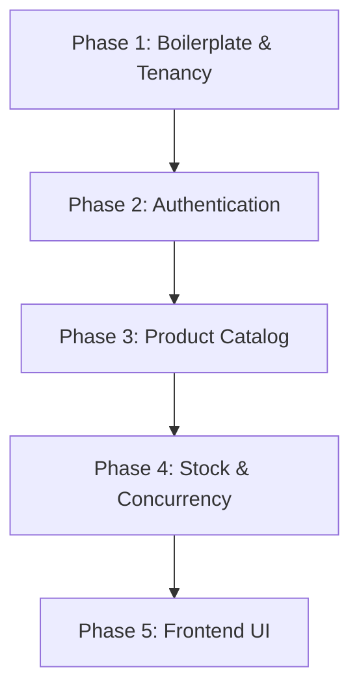

# MVP Implementation Plan: Multi-Tenant Smart Inventory System (SaaS)

This document defines the scoped MVP (Minimum Viable Product) implementation plan for **Inventra**, based on the master [Implementation Plan](implementation_plan.md). It outlines the exact sequential steps and sub-steps required to build a functional, secure, and testable slice of the application.

---

## 🎯 1. MVP Scope Definition

To deliver a working system efficiently, the scope is focused on core value: tenancy isolation, stock tracking with concurrency protection, and catalog management.

### 🟩 In Scope (MVP)

- **Store-Chain Tenancy Model:** Logical isolation using EF Core Global Query Filters (`ChainId`).
- **Authentication & Permissions:** JWT authentication (15 min) + token refresh (7 days, Data Protection API). Roles are static enums (`ChainAdmin`, `StoreManager`, `StoreEmployee`) that define a user's identity and their default permissions. Backend only checks the explicit permissions embedded in the JWT.
- **Product Catalog:** TPT (Table-Per-Type) polymorphism supporting **Physical** and **Perishable** products (Digital products deferred).
- **Inventory Tracking:** Store-level stock counts with `StockMovements` ledger.
- **Basic Reservations:** Active reservations check, safe row locking (`SELECT FOR UPDATE`), and a simplified cleanup query for expired reservations.
- **Frontend SPA (React/Vite):** Core dashboard, login/registration, product view, and stock level adjustment forms.

### 🟥 Out of Scope (Deferred)

- **Permission Editing API & UI:** While users have a mutable list of permissions in the database (`UserPermissions`), the API endpoints and UI to add or remove specific permissions are out of scope for the MVP. Users will receive their role's default permissions at creation.
- **Digital Products:** Specialized download URLs and license keys.
- **Full Procurement Pipeline:** Suppliers list, Purchase Orders placement, and PO receipt flows (stock is added via manual adjustments/receipts instead).
- **Redis Cache Integration:** Local in-memory caching is used; distributed token invalidation is deferred.
- **Database-Native pg_cron Scheduling:** Deferred in favor of a cross-platform dotnet-native background worker.

---

## 🛠️ 2. Step-by-Step MVP Build Order

This section provides the sequential checklist for building the backend and frontend components. Each phase builds upon the previous one.



---

### 📦 Phase 1: Core Setup & Tenancy Infrastructure

The objective of this phase is to establish the Clean Architecture solution and implement the automatic data isolation boundaries.

#### **Step 1.1: WebAPI & Clean Architecture Project Setup**

1. Create the parent directories `backend/` and `frontend/` in the workspace root.
2. Initialize the dotnet solution inside the `backend/` directory: `dotnet new sln -n Inventra`.
3. Create the 4 Clean Architecture projects:
   - `Inventra.Domain` (Class Library): Holds base entities, exceptions, and enums.
   - `Inventra.Application` (Class Library): Houses services, DTOs, interfaces, and validators.
   - `Inventra.Infrastructure` (Class Library): Holds `AppDbContext`, migrations, and security implementations.
   - `Inventra.API` (Web API): Holds controllers, middlewares, and configuration.
4. Link projects to the solution and establish references:
   - `API` -> `Application` & `Infrastructure`
   - `Infrastructure` -> `Application`
   - `Application` -> `Domain`
5. Install packages: `Npgsql.EntityFrameworkCore.PostgreSQL`, `BCrypt.Net-Next`, `Microsoft.AspNetCore.Authentication.JwtBearer`, `Microsoft.AspNetCore.DataProtection`.
6. **Global JSON Casing Policy:** In `Program.cs`, configure the global JSON serializer to use **camelCase** for all request and response properties:
   ```csharp
   builder.Services.AddControllers()
       .AddJsonOptions(o => o.JsonSerializerOptions.PropertyNamingPolicy = JsonNamingPolicy.CamelCase);
   ```
   Without this, ASP.NET Core defaults to PascalCase serialization and silently null-binds all camelCase frontend payloads, producing hard-to-debug `400` errors.

#### **Step 1.2: Tenant Isolation & DbContext Configuration**

1. Define the `ITenantEntity` interface in the Domain layer containing `Guid ChainId`.
2. Define the core tenant entities: `Chain` (ID, Name, PlanType) and `Store` (ID, ChainId, Name, Location).
3. Implement `AppDbContext` and wire the `OnModelCreating` configuration:
   - Automatically apply a Global Query Filter to all entities implementing `ITenantEntity` using the active `ChainId` from `ITenantContext`.
   - **TPT Guard:** The filter loop must skip derived entity types (`if (entityType.BaseType != null) continue;`). EF Core throws `InvalidOperationException` if `HasQueryFilter` is applied to a non-root TPT type. The root entity filter propagates automatically to sub-types via the EF TPT JOIN.
   - **Scoping note:** `InventoryItem`, `Reservation`, and `StockMovement` do **not** implement `ITenantEntity` (no `ChainId` column). Tenant isolation for these entities is enforced manually with a join predicate (`i.Store.ChainId == tenantContext.ChainId`) on every query — there is no EF auto-filter fallback.
   - Configure the PostgreSQL `xmin` system column to act as a concurrency token for the `InventoryItem` entity.
   - **Inventory Bootstrapping (Seed Script):** After migration, a seed script pre-creates `InventoryItem` rows with `Quantity = 0` for every `(StoreId, ProductId)` combination. This means `AdjustStock` can always assume the row exists and will return `404` only for genuinely unknown combinations (not for "first stock entry" scenarios).
4. Generate the initial EF Core migration: `dotnet ef migrations add InitialMigration`.

#### **Step 1.3: Tenancy Context Extraction Middleware**

1. Create `ITenantContext` (scoped) to hold the current request's `ChainId` and optional `StoreId`.
2. Create `TenantMiddleware` in the API layer:
   - Read the token claims (`ChainId`, `StoreId`).
   - Inject these values into `ITenantContext`.
   - Handle unauthenticated paths (e.g., Login/Register) by bypassing extraction.

---

### 🔐 Phase 2: Authentication & Permissions

The objective of this phase is to secure the API and implement the claims-based authorization framework.

#### **Step 2.1: Password Hashing & Permission Template Definitions**

1. Implement password hashing using `BCrypt` in a service (`PasswordHasher`).
2. Define permissions as static string constants (`products:read`, `products:write`, `inventory:read`, `inventory:write`, `inventory:adjust`, `stores:read`, `stores:write`, `users:read`, `users:write`, `users:manage`).
3. Define roles as static enums (`ChainAdmin`, `StoreManager`, `StoreEmployee`) and map them to their respective default permission lists in code. The full template matrix is:

   | Permission         | `ChainAdmin` | `StoreManager` | `StoreEmployee` |
   | ------------------ | :----------: | :------------: | :-------------: |
   | `stores:read`      |      ✅      |       ✅       |       ❌        |
   | `stores:write`     |      ✅      |       ❌       |       ❌        |
   | `products:read`    |      ✅      |       ✅       |       ✅        |
   | `products:write`   |      ✅      |       ❌       |       ❌        |
   | `inventory:read`   |      ✅      |       ✅       |       ✅        |
   | `inventory:write`  |      ✅      |       ✅       |       ❌        |
   | `inventory:adjust` |      ✅      |       ✅       |       ❌        |
   | `users:read`       |      ✅      |       ✅       |       ❌        |
   | `users:write`      |      ✅      |       ❌       |       ❌        |
   | `users:manage`     |      ✅      |       ❌       |       ❌        |

#### **Step 2.2: Login, Registration & JWT Generation**

1. Create the `AuthService`:
   - `RegisterCompany`: Creates a `Chain` and the initial admin `User` inside an EF Core transaction. Persists the admin's default permissions to the `UserPermissions` table based on the `ChainAdmin` role.
   - `Login`: Verifies the email and password, loads the user's effective permissions from the `UserPermissions` table, and issues a 15-minute JWT.
2. Embed the user's `ChainId`, `StoreId`, `Role`, and permissions array as claims in the JWT.
3. Build the custom authorization attribute `[HasPermission(string permission)]` and action filter to block unauthorized requests with a `403 Forbidden` response.

#### **Step 2.3: Refresh Token Flow (Data Protection API)**

1. Define the `RefreshToken` entity (Id, UserId, TokenHash, ExpiresAt, IsRevoked).
2. Use the ASP.NET Core Data Protection API (`IDataProtector`) to encrypt and sign the user payload as a secure opaque string returned to the client.
3. Hash the token using SHA-256 before saving to the database.
4. Implement `POST /api/v1/auth/refresh` to validate the token, perform rotation (revoke old, issue new), and return a fresh JWT.

---

### 📦 Phase 3: Product Catalog & Stores

The objective of this phase is to build the metadata APIs for stores and product structures.

#### **Step 3.1: Stores Management API**

1. Implement `StoreService` (CreateStore, GetStores, GetAccessibleStores).
2. Expose `POST /api/v1/stores` and `GET /api/v1/stores` endpoints (paginated). To ensure `GET /api/v1/stores` is restricted to ChainAdmin only, explicitly validate `tenantContext.StoreId == null` in the controller, because the `stores:read` permission is also held by StoreManagers.
3. Expose `GET /api/v1/stores/accessible`: returns a paginated list of stores the **current user** can access. For `ChainAdmin`, this is all chain stores (used by the Dashboard to resolve a default `storeId` for inventory queries). For `StoreManager`, this returns their single assigned store. _(Note: `StoreEmployee` cannot access this endpoint as they lack `stores:read`. Store-scoped users resolve their `storeId` directly from the JWT on the frontend)._
4. Validate that `Store` creation (`POST /api/v1/stores`) is restricted to users with `stores:write` (ChainAdmin).

#### **Step 3.2: TPT Polymorphic Products API**

1. Define the `Product` entity (base) and TPT sub-types:
   - `PhysicalProduct` (Weight, Dimensions, RequiresStorage)
   - `PerishableProduct` (StorageTemperature)
2. Implement `ProductService.CreateProduct` to map the flat polymorphic request DTO into the correct entity based on the `productType` field.
3. Implement `GET /api/v1/products` with pagination and filters (search name/SKU, product type, isActive). The EF Core global query filter automatically restricts results to the user's `ChainId`.

---

### 📊 Phase 4: Stock Tracking, Adjustments & Reservations

The objective of this phase is to build the core inventory engine, protect against race conditions, and implement transaction-safe stock changes.

#### **Concurrency Strategy Framework**

Concurrency must be handled according to the following tier system:

1. **Atomic conditional update (BEST default)**
   - **Use when:** Single-row invariant, simple numeric/state constraint, no multi-step logic.
   - **Example:** Inventory decrement, quota usage, balance deduction.
   - **Note:** Use whenever possible (e.g., direct stock adjustments).

2. **Row locking (SELECT FOR UPDATE)**
   - **Use when:** You need multi-step logic on the same row, or multiple dependent reads before write.
   - **Example:** Check stock + validate rules + insert reservation, pricing calculation before update.
   - **Note:** Not a fallback — a different category.

3. **Serializable transaction**
   - **Use when:** Invariant spans multiple rows/tables, or complex read consistency is required.
   - **Example:** "User cannot exceed global limit across tables", "No overlapping bookings across calendar range".
   - **Note:** This is NOT weaker than row locking. It’s a different consistency model.

4. **Optimistic concurrency**
   - **Use when:** Conflicts are rare, operations are mostly independent, retries are acceptable.
   - **Example:** Admin editing inventory, product metadata updates, non-critical counters.
   - **Note:** Not a fallback — it’s a performance strategy.

#### **Step 4.1: Stock Management & Movements Ledger**

1. Add `IsDeleted bool` to the `User` entity (soft-delete; users are never hard-deleted).
2. Create the `InventoryItem` entity (`StoreId`, `ProductId`, `Quantity`). **No `ChainId` column** — chain isolation enforced via `InventoryItem.StoreId → Store.ChainId` join. The PostgreSQL `xmin` system column is mapped as the concurrency token; it updates automatically on any row write — no explicit `UpdatedAt` column is needed.
3. Create the `StockMovement` ledger entity (`StoreId`, `ProductId`, `Type` [In/Out/Adjustment], `Quantity`, `Reason`, `CreatedByUserId`).
4. Create `InventoryService` with:
   - `AdjustStock`: Verifies the `InventoryItem` exists (returns `404` if not), applies the signed delta, writes a `StockMovement` audit record, and saves atomically.
   - `GetInventoryLevels`: Filters by `Store.ChainId == tenantContext.ChainId`, then by `StoreId` if the caller is store-scoped. Returns physical, reserved, and available quantity per item.
5. Expose `GET /api/v1/inventory` (`inventory:read`), `GET /api/v1/inventory/summary` (`inventory:read`), and `POST /api/v1/inventory/adjust` (`inventory:adjust`).

#### **Step 4.2: Reservation Engine & Concurrency Control**

1. Create the `Reservation` entity (`StoreId`, `ProductId`, `Quantity`, `Status` [Pending/Completed/Expired], `ExpiresAt`, `CreatedByUserId` [nullable `Guid?`, `ON DELETE RESTRICT`]). **No `ChainId` column** — isolation via `Store.ChainId`. The `RESTRICT` delete constraint prevents hard-deleting users who have created reservations, preserving audit history (users are soft-deleted via `IsDeleted = true`).
2. Implement `ReservationService.CreateReservationAsync`:
   $$\text{Available Stock} = \text{InventoryItem.Quantity} - \sum \text{Active Reservations}$$
3. Implement `POST /api/v1/inventory/reserve` wrapping the operation in an EF Core transaction:
   - Lock the `InventoryItem` row using a raw SQL query with `SELECT FOR UPDATE` to prevent concurrent modifications.
   - Query active reservations and calculate available quantity.
   - Caller supplies `LifetimeMinutes`; service caps it at `Inventory:MaxReservationLifetimeMinutes` from config.
   - If stock is sufficient, insert a `Pending` reservation.
   - If stock is insufficient, immediately roll back the transaction and return a `409 Conflict` (no retry loop is needed).

#### **Step 4.3: Expired Reservations Cleanup**

1. Implement a `BackgroundService` (`ReservationCleanupWorker`) in the WebAPI project — triggers every 60 seconds.
2. Under a scoped lifetime, resolve `AppDbContext` and execute a parameterized SQL command:
   `UPDATE "Reservations" SET "Status" = 'Expired' WHERE "Status" = 'Pending' AND "ExpiresAt" < {utcNow}`.

> 🚫 **pg_cron is NOT used in the MVP.** `pg_cron` requires PostgreSQL superuser access and a compatible host. The `BackgroundService` approach keeps the application host-agnostic. pg_cron is documented in `implementation_plan.md` Step 9 as a post-MVP upgrade path for production deployments.

---

### 💻 Phase 5: Frontend MVP (React + Vite + TypeScript + TanStack Query + Zustand)

The objective of this phase is to construct the user interface and integrate it with the backend API using a modern, type-safe frontend stack.

> ⚠️ **Pre-requisite backend changes** — Before starting Phase 5 frontend work, apply these four backend modifications:
>
> 1. **CORS:** Add a named CORS policy with `AllowCredentials()` to `Program.cs` allowing `http://localhost:5173`.
> 2. **HttpOnly Cookie:** Change `AuthController` login/register/refresh/logout endpoints to deliver the refresh token via `HttpOnly`/`Secure`/`SameSite=Strict` cookie instead of the JSON body.
> 3. **Extended `AuthResponse`:** Add `UserId`, `ChainId`, and `StoreId` fields to the `AuthResponse` record.
> 4. **Inventory `storeId` filter:** Add an optional `[FromQuery] Guid? storeId` parameter to `GET /api/v1/inventory`; the service applies it only when the caller is a `ChainAdmin`.

#### **Step 5.1: Scaffold & Layout Setup**

1. Initialize the frontend using Vite + React + TypeScript inside the `frontend/` directory: `npx -y create-vite@latest frontend --template react-ts`.
2. Install frontend dependencies: `npm install @tanstack/react-query zustand axios react-router-dom react-hook-form zod @hookform/resolvers`.
3. Set up the `QueryClient` and `QueryClientProvider` at the application root (`main.tsx`).
4. Configure vanilla CSS variables for colors, typography, and spacing (supporting light/dark themes).
5. Define TypeScript interfaces matching the backend API DTOs (`AuthResponse`, `StoreResponse`, `ProductResponse`, `InventoryLevelResponse`, `AdjustStockRequest`, etc.) in `src/types/index.ts`. `AuthResponse` must include `userId`, `chainId`, and `storeId`.
6. Create the Axios `apiClient` (`src/services/apiClient.ts`) with:
   - A **request interceptor** that injects the JWT `Authorization: Bearer <token>` header from the Zustand auth store.
   - A **response interceptor** implementing the singleton in-flight refresh pattern: on a 401, if no refresh is already in-flight, call `POST /api/v1/auth/refresh` (the browser sends the HttpOnly cookie automatically), update the Zustand token, and retry all queued requests. If the refresh fails, call `clearAuth()` and redirect to `/login`.
7. Set up React Router v6 and define the app route tree:
   - Public routes: `/login`, `/register`.
   - Protected layout shell (`/`) wrapping all authenticated pages with a Sidebar and Topbar.
   - Inventory route uses a path param: `/inventory/:storeId`.
   - Error route: `/unauthorized` — rendered when a user is authenticated but lacks the required permission. Display an "Access Denied" message with a back link.

#### **Step 5.2: Auth Shell & Guards**

1. Create the Zustand `useAuthStore` to hold the in-memory JWT, email, role, permissions, `userId`, `chainId`, and `storeId`. No persistence — token is re-hydrated on page load via a silent refresh.
2. Implement a silent-refresh bootstrap: on app mount (`App.tsx`), track an `isHydrating: boolean` state (initially `true`). While `isHydrating` is `true`, render a full-screen spinner (centered logo + subtle animation). Call `POST /api/v1/auth/refresh` with a 5-second Axios timeout. On success, populate the Zustand store with the new token and user identity, then set `isHydrating = false`. On failure (cookie expired/absent or timeout), set `isHydrating = false` and leave the store empty — `RouteGuard` redirects to `/login`.
3. Build the `Login` and `RegisterCompany` pages using `react-hook-form` + `zod` for form validation and TanStack Query `useMutation` for API calls.
4. Build the `RouteGuard` component: checks `isAuthenticated` from `useAuthStore` (redirects to `/login` if false), optionally checks a required permission string (redirects to `/unauthorized` if missing), and optionally enforces store-scoping via a `storeScope` prop. When `storeScope` is `true`, `RouteGuard` reads `storeId` from `useParams()` and, if the caller is not a ChainAdmin and the param does not match their JWT `storeId`, immediately replaces the URL with `/inventory/:jwtStoreId`.

#### **Step 5.3: Pages & Forms**

1. **Dashboard Page:** Displays key stats (total product lines, low-stock alerts) fetched via TanStack Query `useQuery` from the dedicated `GET /api/v1/inventory/summary` endpoint.
   - **`storeId` source for Dashboard:** The Dashboard at `/dashboard` has no `:storeId` URL param. The `storeId` to pass to `GET /api/v1/inventory/summary` is resolved as follows:
     - **`ChainAdmin`:** Call `GET /api/v1/stores/accessible` (returns a paginated list of stores the current user can access) and use the **first store's ID** from the response. If no stores exist, render a setup banner and omit the `storeId` param to show chain-wide stats.
     - **`StoreManager` / `StoreEmployee`:** Read `storeId` directly from `useAuthStore` (populated from the JWT `storeId` claim at login). Always pass this value — store-scoped users always have a non-null `storeId`.
   - This ensures the Dashboard always shows per-store stats instead of inaccurate chain-wide aggregates.
2. **Product Catalog Page:** Table view listing products (fetched via `useQuery`), with a modal form to create a product:
   - Product type selection (Physical / Perishable) drives conditional field visibility via `react-hook-form` `watch`.
   - A `zod` discriminated union schema validates sub-type-specific required fields on the frontend before submitting.
   - `useMutation` handles the API call with automatic `queryClient.invalidateQueries(['products'])` on success.
   - Backend 400 errors (e.g., duplicate SKU) are caught and displayed in a form-level error banner.
3. **Inventory Management Page** (`/inventory/:storeId`):
   - Reads `storeId` from `useParams()`.
   - Fetches inventory via `useQuery({ queryKey: ['inventory', storeId], queryFn: () => fetchInventory(storeId) })`.
   - For a **ChainAdmin** navigating to `/inventory` with no `storeId`, auto-redirect to `/inventory/<first-store-id>` using the first result from the stores list. If the stores list is empty, redirect to `/stores` with a setup banner: _"You have no stores yet. Create your first store to start tracking inventory."_
   - For **store-scoped users** (StoreManager / StoreEmployee), `RouteGuard` (with `storeScope` prop) intercepts any URL mismatch and redirects to `/inventory/<jwt-storeId>` — no logic needed inside `StockControl.tsx`.
   - The Topbar store picker (visible to ChainAdmin only) calls `navigate('/inventory/' + newStoreId)` on selection.
   - The stock adjustment modal uses a `MovementType` dropdown with human-readable labels (`Stock Receipt`, `Stock Removal`, `Manual Adjustment`) mapped to the backend **PascalCase enum values** (`In`, `Out`, `Adjustment`). A `zod` rule validates that the delta sign matches the selected movement type.
     > ⚠️ **`MovementType` casing:** The C# enum is `In`, `Out`, `Adjustment` (PascalCase). JSON serialization uses PascalCase strings. Do **not** use ALL_CAPS (`IN`, `OUT`). All backend services, test assertions, and frontend mappings must use PascalCase.

---

## 🎨 3. Frontend Architecture & Stack

### Technical Stack Overview

The frontend is built as a single-page application (SPA) optimized for speed, developer velocity, and type safety:

- **Build Tool:** Vite (for fast HMR and optimized production builds)
- **Language:** TypeScript (strict type checking enabled to prevent runtime errors)
- **Router:** React Router v6 (for declarative routing and layouts)
- **Server State:** TanStack Query v5 (React Query) (for caching, background updates, loading/error state management)
- **Client UI State:** Zustand (for lightweight, reactive, global client state)
- **Styling:** Vanilla CSS (CSS Variables + CSS Modules for encapsulation)

### TypeScript Type-Safety Guidelines

- **Zero `any` Policy:** All API responses, request payloads, and component props must be explicitly typed.
- **Shared API Contracts:** Define matching TypeScript types/interfaces for all backend DTOs inside `src/types/index.ts`.
- **Component Props:** Always type props using interfaces, avoiding inline type annotations.

### Server State (TanStack Query v5)

- **Caching & Invalidation:** All GET requests use `useQuery`. Write operations (POST/PATCH/DELETE) use `useMutation`.
- **Cache Invalidation:** Always call `queryClient.invalidateQueries` inside mutation `onSuccess` hooks to trigger automatic refetches.
- **Example TanStack Query Hook Pattern:**

  ```typescript
  import { useQuery, useMutation, useQueryClient } from "@tanstack/react-query";
  import { fetchProducts, createProduct } from "../services/api/productService";
  import { ProductDto, CreateProductRequest } from "../types";

  export const useProducts = () => {
    const queryClient = useQueryClient();

    const productsQuery = useQuery<ProductDto[]>({
      queryKey: ["products"],
      queryFn: fetchProducts,
    });

    const createProductMutation = useMutation({
      mutationFn: (newProduct: CreateProductRequest) =>
        createProduct(newProduct),
      onSuccess: () => {
        // Automatically refresh catalog on successful creation
        queryClient.invalidateQueries({ queryKey: ["products"] });
      },
    });

    return {
      products: productsQuery.data ?? [],
      isLoading: productsQuery.isLoading,
      isError: productsQuery.isError,
      createProduct: createProductMutation.mutate,
      isCreating: createProductMutation.isPending,
    };
  };
  ```

### Client UI State (Zustand)

- **Purpose:** Zustand is dedicated strictly to client-only state that does not come from a database (e.g., UI toggles, local preferences, store selection, auth status).
- **Example Auth and UI Store:**

  ```typescript
  import { create } from "zustand";
  import { UserDto } from "../types";

  interface AuthState {
    user: UserDto | null;
    token: string | null;
    setAuth: (user: UserDto, token: string) => void;
    clearAuth: () => void;
  }

  export const useAuthStore = create<AuthState>((set) => ({
    user: null,
    token: null,
    setAuth: (user, token) => set({ user, token }),
    clearAuth: () => set({ user: null, token: null }),
  }));
  ```

---

## 🧪 4. MVP Testing Checklist

Before completing the MVP, the following behavior must be verified:

1. **Isolation Test:** Creating a product in Tenant A must _never_ make it visible when querying as Tenant B.
2. **Scoping Test:** A user scoped to Store A must _never_ be able to view inventory levels or submit adjustments for Store B.
3. **Concurrency Test:** Simulating 10 parallel requests to reserve the same 1 remaining unit of stock must result in exactly 1 success and 9 failures (or retries resulting in clean stock-out responses).
4. **Token Rotation Test:** Reusing an old refresh token must result in rejection, and logouts must invalidate refresh tokens immediately.

---

## 📝 5. Confirmed MVP Architecture & Design Choices

The following decisions have been finalized and are locked in for the development phase:

1. **Roles & Mutable Permissions:** The API endpoints and UI for managing individual user permissions are deferred. Roles (`ChainAdmin`, `StoreManager`, `StoreEmployee`) function as an identity and define a user's default permissions at creation time. These permissions are stored in a `UserPermissions` table, making them architecturally mutable for future phases. For the MVP, they remain static after creation.
2. **Physical & Perishable Focus:** Digital products are deferred; polymorphic schema and CRUD operations support base Product, Physical, and Perishable types only.
3. **Direct Stock Adjustments:** Suppliers registry and Purchase Order workflows are deferred. Initial stock counts and edits are managed through direct adjustments.
   > ✅ **Inventory Bootstrapping (Seed Script):** A seed script pre-creates `InventoryItem` rows at `Quantity = 0` for every `(StoreId, ProductId)` combination after migration. `AdjustStock` returns `404` only for unknown combinations — not for "first stock entry" situations. No initialization endpoint is needed.
4. **Dotnet-Native Background Service:** A dotnet `BackgroundService` is selected over database-specific `pg_cron` dependencies to keep the application host-agnostic. It runs a scheduled task every 60 seconds to update expired reservation records. pg_cron is documented as a post-MVP upgrade path only.
5. **Token Storage — In-Memory JWT + HttpOnly Cookie:** The access JWT is stored in Zustand (in-memory only, cleared on refresh). The refresh token is delivered and stored as an `HttpOnly`/`Secure`/`SameSite=Strict` cookie — never accessible from JavaScript. On page load, `App.tsx` tracks an `isHydrating` state that renders a full-screen spinner while `POST /api/v1/auth/refresh` completes (5-second timeout). On success, the Zustand store is populated and the spinner is dismissed. On failure, `isHydrating` is cleared and `RouteGuard` redirects to `/login`.
6. **Axios Singleton Refresh Pattern:** The Axios response interceptor in `apiClient.ts` uses a module-level in-flight promise to ensure that multiple concurrent 401 responses trigger exactly one `POST /api/v1/auth/refresh` call. All other expired requests queue and retry with the new token once the refresh resolves.
7. **Inventory URL-Scoped Routing:** The Inventory Management page route is `/inventory/:storeId`. The `storeId` path param drives both the TanStack Query cache key (`['inventory', storeId]`) and the optional `?storeId=` filter sent to `GET /api/v1/inventory`. ChainAdmins default to the first store in their list; if no stores exist they are redirected to `/stores` with a setup banner. Store-scoped users are locked to their own store by `RouteGuard`.
8. **Form Validation — `react-hook-form` + `zod`:** All forms (login, register, create product, adjust stock) use `react-hook-form` with `zod` resolver. Polymorphic product creation uses a `zod` discriminated union on `productType` to conditionally validate sub-type fields client-side. Backend validation remains the authoritative gate; backend 400 errors surface as form-level banners.
9. **Extended `AuthResponse`:** The `AuthResponse` DTO is extended to include `UserId`, `ChainId`, and `StoreId` so the frontend does not need to decode the JWT. `StoreId` is `null` for `ChainAdmin` users.
10. **CORS with Credentials:** A named CORS policy (`FrontendDev`) is registered in `Program.cs` allowing `http://localhost:5173` with `AllowCredentials()`. This is required for the HttpOnly cookie to be transmitted on cross-origin requests during local development.
11. **`MovementType` Explicit Dropdown (PascalCase enum):** The stock adjustment form exposes a required `MovementType` dropdown with human-readable labels (`Stock Receipt`, `Stock Removal`, `Manual Adjustment`). The backend C# enum uses **PascalCase**: `In`, `Out`, `Adjustment` — serialized as PascalCase JSON strings. A `zod` rule enforces that the delta sign is consistent with the selected type.
12. **`InventoryItem`, `Reservation`, `StockMovement` — No `ChainId`:** These three entities do not implement `ITenantEntity` and have no `ChainId` column. Tenant isolation is enforced via explicit join predicates (`Store.ChainId == tenantContext.ChainId`) on every query. The EF Global Query Filter does NOT apply to them.
13. **`CreatedByUserId` FK — `RESTRICT` delete:** `StockMovement.CreatedByUserId` and `Reservation.CreatedByUserId` use `ON DELETE RESTRICT`. Users are soft-deleted via `IsDeleted = true` — hard deletion is blocked by `RESTRICT` as a safety net to preserve audit history.
14. **`StorageTemperature` type — `decimal`:** `PerishableProduct.StorageTemperature` is a `decimal` number (°C), not a string. API request/response uses `4.0`, not `"2-8°C"`. The SQL column is `DECIMAL(5,2)`.
15. **`RouteGuard` — `storeScope` prop:** `RouteGuard` accepts an optional boolean `storeScope` prop. When `true`, it reads `storeId` from `useParams()` and redirects non-ChainAdmin users to `/inventory/:jwtStoreId` if the param doesn’t match their JWT claim. This centralizes store-lock enforcement for all current and future store-scoped routes.
16. **`useAuth` Hook — Full Helper Set:** `hooks/useAuth.ts` wraps `useAuthStore` and exposes computed properties: `isAuthenticated` (`!!token`), `isChainAdmin` (`role === 'ChainAdmin'`), and `hasPermission(p: string)` (checks `permissions.includes(p) || permissions.includes('*')`). Components use `useAuth()` as the single entry point; direct store access is reserved for non-React contexts (e.g., the Axios interceptor).
