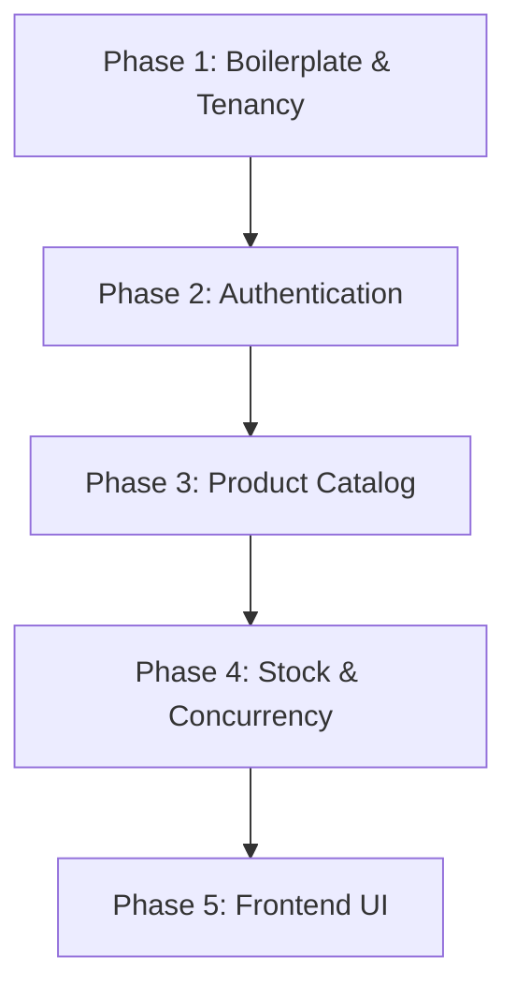

# MVP Implementation Plan: Multi-Tenant Smart Inventory System (SaaS)

This document defines the scoped MVP (Minimum Viable Product) implementation plan for **Inventra**, based on the master [Implementation Plan](implementation_plan.md). It outlines the exact sequential steps and sub-steps required to build a functional, secure, and testable slice of the application.

---

## 🎯 1. MVP Scope Definition

To deliver a working system efficiently, the scope is focused on core value: tenancy isolation, stock tracking with concurrency protection, and catalog management.

### 🟩 In Scope (MVP)
* **Store-Chain Tenancy Model:** Logical isolation using EF Core Global Query Filters (`ChainId`).
* **Authentication & Static RBAC:** JWT authentication (15 min) + token refresh (7 days, Data Protection API). Roles are static enums (`ChainAdmin`, `StoreManager`, `StoreEmployee`) with hardcoded permission lists.
* **Product Catalog:** TPT (Table-Per-Type) polymorphism supporting **Physical** and **Perishable** products (Digital products deferred).
* **Inventory Tracking:** Store-level stock counts with `StockMovements` ledger.
* **Basic Reservations:** Active reservations check, optimistic concurrency control (`xmin` row version), and a simplified cleanup query for expired reservations.
* **Frontend SPA (React/Vite):** Core dashboard, login/registration, product view, and stock level adjustment forms.

### 🟥 Out of Scope (Deferred)
* **Dynamic RBAC Editor:** Database tables for dynamic roles and UI to create/manage custom permissions (uses static configuration for now).
* **Digital Products:** Specialized download URLs and license keys.
* **Full Procurement Pipeline:** Suppliers list, Purchase Orders placement, and PO receipt flows (stock is added via manual adjustments/receipts instead).
* **Redis Cache Integration:** Local in-memory caching is used; distributed token invalidation is deferred.
* **Database-Native pg_cron Scheduling:** Deferred in favor of a cross-platform dotnet-native background worker.

---

## 🛠️ 2. Step-by-Step MVP Build Order

This section provides the sequential checklist for building the backend and frontend components. Each phase builds upon the previous one.



---

### 📦 Phase 1: Core Setup & Tenancy Infrastructure

The objective of this phase is to establish the Clean Architecture solution and implement the automatic data isolation boundaries.

#### **Step 1.1: WebAPI & Clean Architecture Project Setup**
1. Create the parent directories `backend/` and `frontend/` in the workspace root.
2. Initialize the dotnet solution inside the `backend/` directory: `dotnet new sln -n Inventra`.
3. Create the 4 Clean Architecture projects:
   * `Inventra.Domain` (Class Library): Holds base entities, exceptions, and enums.
   * `Inventra.Application` (Class Library): Houses services, DTOs, interfaces, and validators.
   * `Inventra.Infrastructure` (Class Library): Holds `AppDbContext`, migrations, and security implementations.
   * `Inventra.API` (Web API): Holds controllers, middlewares, and configuration.
4. Link projects to the solution and establish references:
   * `API` -> `Application` & `Infrastructure`
   * `Infrastructure` -> `Application`
   * `Application` -> `Domain`
5. Install packages: `Npgsql.EntityFrameworkCore.PostgreSQL`, `BCrypt.Net-Next`, `Microsoft.AspNetCore.Authentication.JwtBearer`, `Microsoft.AspNetCore.DataProtection`.

#### **Step 1.2: Tenant Isolation & DbContext Configuration**
1. Define the `ITenantEntity` interface in the Domain layer containing `Guid ChainId`.
2. Define the core tenant entities: `Chain` (ID, Name, PlanType) and `Store` (ID, ChainId, Name, Location).
3. Implement `AppDbContext` and wire the `OnModelCreating` configuration:
   * Automatically apply a Global Query Filter to all entities implementing `ITenantEntity` using the active `ChainId` from `ITenantContext`.
   * Configure the PostgreSQL `xmin` system column to act as a concurrency token for the `InventoryItem` entity.
4. Generate the initial EF Core migration: `dotnet ef migrations add InitialMigration`.

#### **Step 1.3: Tenancy Context Extraction Middleware**
1. Create `ITenantContext` (scoped) to hold the current request's `ChainId` and optional `StoreId`.
2. Create `TenantMiddleware` in the API layer:
   * Read the token claims (`ChainId`, `StoreId`).
   * Inject these values into `ITenantContext`.
   * Handle unauthenticated paths (e.g., Login/Register) by bypassing extraction.

---

### 🔐 Phase 2: Authentication & Static RBAC

The objective of this phase is to secure the API and implement the claims-based authorization framework.

#### **Step 2.1: Password Hashing & Static Permission Definitions**
1. Implement password hashing using `BCrypt` in a service (`PasswordHasher`).
2. Define permissions as static string constants (`products:read`, `products:write`, `inventory:read`, `inventory:write`, `inventory:adjust`).
3. Define roles (`ChainAdmin`, `StoreManager`, `StoreEmployee`) and map them to their respective static permission lists in code.

#### **Step 2.2: Login, Registration & JWT Generation**
1. Create the `AuthService`:
   * `RegisterCompany`: Creates a `Chain` and the initial admin `User` inside an EF Core transaction.
   * `Login`: Verifies the email and password, resolves the effective static permissions, and issues a 15-minute JWT.
2. Embed the user's `ChainId`, `StoreId`, and deduplicated permissions array as claims in the JWT.
3. Build the custom authorization attribute `[HasPermission(string permission)]` and action filter to block unauthorized requests with a `403 Forbidden` response.

#### **Step 2.3: Refresh Token Flow (Data Protection API)**
1. Define the `RefreshToken` entity (Id, UserId, TokenHash, ExpiresAt, IsRevoked).
2. Use the ASP.NET Core Data Protection API (`IDataProtector`) to encrypt and sign the user payload as a secure opaque string returned to the client.
3. Hash the token using SHA-256 before saving to the database.
4. Implement `POST /api/v1/auth/refresh` to validate the token, perform rotation (revoke old, issue new), and return a fresh JWT.

---

### 📦 Phase 3: Product Catalog & Stores

The objective of this phase is to build the metadata APIs for stores and product structures.

#### **Step 3.1: Stores Management API**
1. Implement `StoreService` (CreateStore, GetStores).
2. Expose `POST /api/v1/stores` and `GET /api/v1/stores` endpoints.
3. Validate that `Store` creation is restricted to users with `stores:write` (ChainAdmin).

#### **Step 3.2: TPT Polymorphic Products API**
1. Define the `Product` entity (base) and TPT sub-types:
   * `PhysicalProduct` (Weight, Dimensions)
   * `PerishableProduct` (StorageTemperature)
2. Implement `ProductService.CreateProduct` to map polymorphic requests into the correct entities.
3. Implement `GET /api/v1/products` with filters (search name/SKU, product type). Ensure the global query filter restricts results to the user's `ChainId`.

---

### 📊 Phase 4: Stock Tracking, Adjustments & Reservations

The objective of this phase is to build the core inventory engine, protect against race conditions, and implement transaction-safe stock changes.

#### **Step 4.1: Stock Management & Movements Ledger**
1. Add `IsDeleted bool` to the `User` entity (soft-delete; users are never hard-deleted).
2. Create the `InventoryItem` entity (`StoreId`, `ProductId`, `Quantity`, `UpdatedAt`). **No `ChainId` column** — chain isolation enforced via `InventoryItem.StoreId → Store.ChainId` join.
3. Create the `StockMovement` ledger entity (`StoreId`, `ProductId`, `Type` [In/Out/Adjustment], `Quantity`, `Reason`, `CreatedByUserId`).
4. Create `InventoryService` with:
   * `AdjustStock`: Verifies the `InventoryItem` exists (returns `404` if not), applies the signed delta, writes a `StockMovement` audit record, and saves atomically.
   * `GetInventoryLevels`: Filters by `Store.ChainId == tenantContext.ChainId`, then by `StoreId` if the caller is store-scoped. Returns physical, reserved, and available quantity per item.
5. Expose `GET /api/v1/inventory` (`inventory:read`) and `POST /api/v1/inventory/adjust` (`inventory:adjust`).

#### **Step 4.2: Reservation Engine & Concurrency Control**
1. Create the `Reservation` entity (`StoreId`, `ProductId`, `Quantity`, `Status` [Pending/Completed/Expired], `ExpiresAt`). **No `ChainId` column** — isolation via `Store.ChainId`.
2. Implement `ReservationService.CreateReservationAsync`:
   $$\text{Available Stock} = \text{InventoryItem.Quantity} - \sum \text{Active Reservations}$$
3. Implement `POST /api/v1/inventory/reserve` wrapping the operation in an EF Core transaction:
   * Retrieve `InventoryItem` (tracked, includes `xmin` shadow property) and calculate available quantity.
   * Caller supplies `LifetimeMinutes`; service caps it at `Inventory:MaxReservationLifetimeMinutes` from config.
   * If stock is sufficient, **touch** `InventoryItem.UpdatedAt` (triggers the xmin check) and insert a `Pending` reservation.
   * Catch `DbUpdateConcurrencyException` (xmin mismatch — another thread modified the row) and retry up to 3 times before returning `409 Conflict`.

#### **Step 4.3: Expired Reservations Cleanup**
1. Implement a `BackgroundService` (`ReservationCleanupWorker`) in the WebAPI project — triggers every 60 seconds.
2. Under a scoped lifetime, resolve `AppDbContext` and execute a parameterized SQL command:
   `UPDATE "Reservations" SET "Status" = 'Expired' WHERE "Status" = 'Pending' AND "ExpiresAt" < {utcNow}`.

---

### 💻 Phase 5: Frontend MVP (React + Vite + TypeScript + TanStack Query + Zustand)

The objective of this phase is to construct the user interface and integrate it with the backend API using a modern, type-safe frontend stack.

#### **Step 5.1: Scaffold & Layout Setup**
1. Initialize the frontend using Vite + React + TypeScript inside the `frontend/` directory: `npx -y create-vite@latest frontend --template react-ts`.
2. Install frontend dependencies: `npm install @tanstack/react-query zustand axios react-router-dom`.
3. Set up the `QueryClient` and `QueryClientProvider` at the application root (`main.tsx`).
4. Configure vanilla CSS variables for colors, typography, and spacing (supporting light/dark themes).
5. Define TypeScript interfaces matching the backend API DTOs (e.g., `UserDto`, `ChainDto`, `StoreDto`, `ProductDto`, `InventoryItemDto`) in `src/types/index.ts`.
6. Create the Axios `apiClient` configured with automatic bearer token injection and a response interceptor for token refresh.
7. Set up React Router v6 and create the layout with a Sidebar (navigation) and Topbar (user info & store selection).

#### **Step 5.2: Auth Shell & Guards**
1. Create a Zustand store (`useAuthStore`) to manage user login state, the JWT, and resolved user permissions.
2. Build the `Login` and `RegisterCompany` pages using React state and TanStack Query mutations (`useMutation`) for API calls.
3. Build the `RouteGuard` component to wrap protected routes, checking permissions from the Zustand store and redirecting unauthorized users.

#### **Step 5.3: Pages & Forms**
1. **Dashboard Page:** Displays key stats (total items, low-stock alerts) fetched via TanStack Query `useQuery`.
2. **Product Catalog Page:** Table view listing products (fetched via `useQuery`), with a modal form to create a product (allowing Physical/Perishable type selection) handled via `useMutation` with automatic query invalidation.
3. **Inventory Management Page:** List view showing physical, reserved, and available stock levels (fetched via `useQuery` scoped to the selected store), plus a form/modal to submit stock adjustments handled via `useMutation`.

---

## 🎨 3. Frontend Architecture & Stack

### Technical Stack Overview
The frontend is built as a single-page application (SPA) optimized for speed, developer velocity, and type safety:
* **Build Tool:** Vite (for fast HMR and optimized production builds)
* **Language:** TypeScript (strict type checking enabled to prevent runtime errors)
* **Router:** React Router v6 (for declarative routing and layouts)
* **Server State:** TanStack Query v5 (React Query) (for caching, background updates, loading/error state management)
* **Client UI State:** Zustand (for lightweight, reactive, global client state)
* **Styling:** Vanilla CSS (CSS Variables + CSS Modules for encapsulation)

### TypeScript Type-Safety Guidelines
* **Zero `any` Policy:** All API responses, request payloads, and component props must be explicitly typed.
* **Shared API Contracts:** Define matching TypeScript types/interfaces for all backend DTOs inside `src/types/index.ts`.
* **Component Props:** Always type props using interfaces, avoiding inline type annotations.

### Server State (TanStack Query v5)
* **Caching & Invalidation:** All GET requests use `useQuery`. Write operations (POST/PATCH/DELETE) use `useMutation`.
* **Cache Invalidation:** Always call `queryClient.invalidateQueries` inside mutation `onSuccess` hooks to trigger automatic refetches.
* **Example TanStack Query Hook Pattern:**
  ```typescript
  import { useQuery, useMutation, useQueryClient } from '@tanstack/react-query';
  import { fetchProducts, createProduct } from '../services/api/productService';
  import { ProductDto, CreateProductRequest } from '../types';

  export const useProducts = () => {
    const queryClient = useQueryClient();

    const productsQuery = useQuery<ProductDto[]>({
      queryKey: ['products'],
      queryFn: fetchProducts,
    });

    const createProductMutation = useMutation({
      mutationFn: (newProduct: CreateProductRequest) => createProduct(newProduct),
      onSuccess: () => {
        // Automatically refresh catalog on successful creation
        queryClient.invalidateQueries({ queryKey: ['products'] });
      },
    });

    return {
      products: productsQuery.data ?? [],
      isLoading: productsQuery.isLoading,
      isError: productsQuery.isError,
      createProduct: createProductMutation.mutate,
      isCreating: createProductMutation.isPending,
    };
  };
  ```

### Client UI State (Zustand)
* **Purpose:** Zustand is dedicated strictly to client-only state that does not come from a database (e.g., UI toggles, local preferences, store selection, auth status).
* **Example Auth and UI Store:**
  ```typescript
  import { create } from 'zustand';
  import { UserDto } from '../types';

  interface AuthState {
    user: UserDto | null;
    token: string | null;
    setAuth: (user: UserDto, token: string) => void;
    clearAuth: () => void;
  }

  export const useAuthStore = create<AuthState>((set) => ({
    user: null,
    token: null,
    setAuth: (user, token) => set({ user, token }),
    clearAuth: () => set({ user: null, token: null }),
  }));
  ```

---

## 🧪 4. MVP Testing Checklist

Before completing the MVP, the following behavior must be verified:

1. **Isolation Test:** Creating a product in Tenant A must *never* make it visible when querying as Tenant B.
2. **Scoping Test:** A user scoped to Store A must *never* be able to view inventory levels or submit adjustments for Store B.
3. **Concurrency Test:** Simulating 10 parallel requests to reserve the same 1 remaining unit of stock must result in exactly 1 success and 9 failures (or retries resulting in clean stock-out responses).
4. **Token Rotation Test:** Reusing an old refresh token must result in rejection, and logouts must invalidate refresh tokens immediately.

---

## 📝 5. Confirmed MVP Architecture & Design Choices

The following decisions have been finalized and are locked in for the development phase:

1. **Static Roles & Permissions:** Dynamic RBAC tables and dynamic role management UI are deferred. Static roles (`ChainAdmin`, `StoreManager`, `StoreEmployee`) are implemented in code with pre-defined permission scopes.
2. **Physical & Perishable Focus:** Digital products are deferred; polymorphic schema and CRUD operations support base Product, Physical, and Perishable types only.
3. **Direct Stock Adjustments:** Suppliers registry and Purchase Order workflows are deferred. Initial stock counts and edits are managed through direct adjustments.
4. **Dotnet-Native Background Service:** A dotnet `BackgroundService` is selected over database-specific `pg_cron` dependencies to keep the application host-agnostic. It runs a scheduled task every 60 seconds to update expired reservation records.
